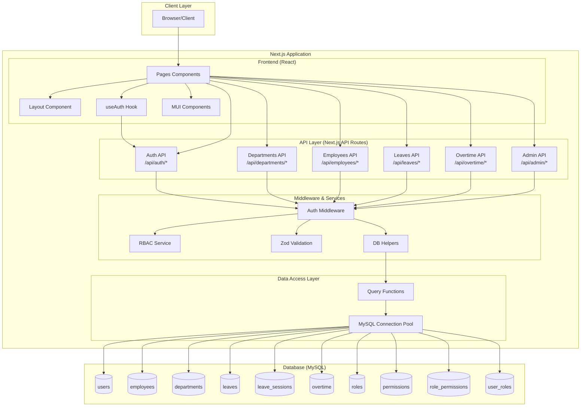
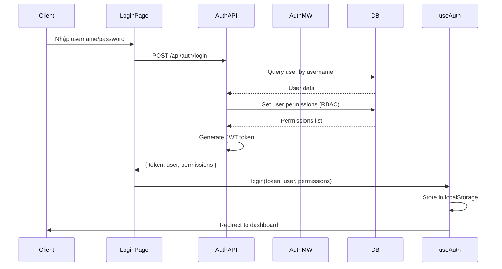
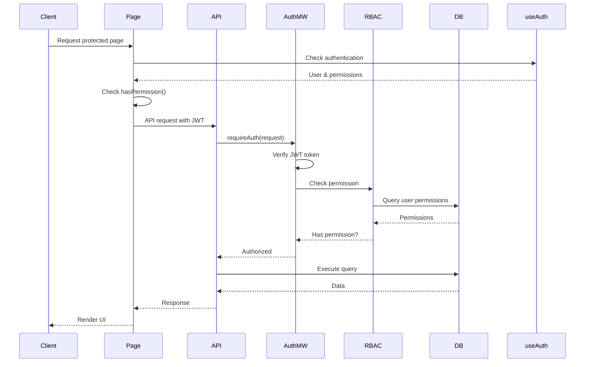
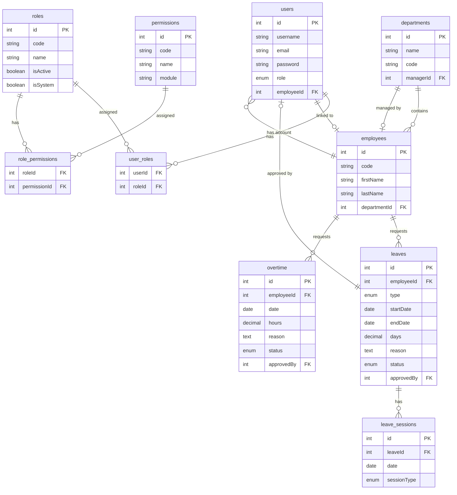

# Sơ đồ Kiến trúc Dự án HRMS

## Tổng quan

Hệ thống HRMS (Human Resource Management System) được xây dựng trên nền tảng **Next.js 14** với kiến trúc Full-Stack, sử dụng **MySQL** làm database và **JWT** cho authentication.

## Kiến trúc Tổng thể



## Cấu trúc Thư mục

```
hrmsa2/
├── app/                          # Next.js App Router
│   ├── api/                      # API Routes (Backend)
│   │   ├── auth/                 # Authentication endpoints
│   │   │   ├── login/route.ts
│   │   │   └── register/route.ts
│   │   ├── departments/          # Department management
│   │   │   ├── route.ts          # GET, POST
│   │   │   └── [id]/route.ts     # GET, PUT, DELETE
│   │   ├── employees/            # Employee management
│   │   │   ├── route.ts
│   │   │   └── [id]/
│   │   │       ├── route.ts
│   │   │       └── account/route.ts
│   │   ├── leaves/               # Leave management
│   │   │   ├── route.ts
│   │   │   └── [id]/route.ts
│   │   ├── overtime/             # Overtime management
│   │   │   ├── route.ts
│   │   │   └── [id]/route.ts
│   │   └── admin/               # RBAC administration
│   │       ├── roles/
│   │       ├── permissions/
│   │       └── users/
│   ├── departments/page.tsx     # Department page (Frontend)
│   ├── employees/page.tsx        # Employee page
│   ├── leaves/page.tsx           # Leave page
│   ├── overtime/page.tsx          # Overtime page
│   ├── admin/                    # Admin pages
│   │   ├── roles/page.tsx
│   │   └── users/page.tsx
│   ├── login/page.tsx            # Login page
│   ├── page.tsx                  # Dashboard
│   └── layout.tsx                # Root layout
│
├── components/                   # React Components
│   ├── Layout.tsx                # Main layout with sidebar
│   └── ThemeProvider.tsx         # MUI theme provider
│
├── hooks/                        # React Hooks
│   └── useAuth.tsx               # Authentication hook
│
├── lib/                          # Shared Libraries
│   ├── db.ts                     # Database connection pool
│   ├── middleware/
│   │   └── auth.ts               # Auth & RBAC middleware
│   ├── types/
│   │   └── index.ts              # TypeScript types
│   └── utils/
│       ├── auth.ts               # JWT & password utilities
│       ├── validation.ts        # Zod schemas
│       ├── db-helpers.ts         # Database helpers
│       └── leave-helpers.ts      # Leave calculation helpers
│
├── database/                     # Database Schemas
│   ├── schema.sql                # Main schema
│   ├── rbac-schema.sql           # RBAC tables
│   └── migration-*.sql          # Migration scripts
│
└── scripts/                      # Utility Scripts
    ├── init-db.ts                # Initialize database
    ├── create-admin.js           # Create admin user
    └── migrate-*.js              # Migration scripts
```

## Luồng Xác thực (Authentication Flow)



## Luồng Phân quyền (Authorization Flow)



## Kiến trúc Database



## Các Module Chính

### 1. Authentication & Authorization
- **JWT-based authentication**: Token được lưu trong localStorage
- **RBAC (Role-Based Access Control)**: 
  - Roles: Admin, HR, Manager, Employee
  - Permissions: Fine-grained permissions per module
  - Dynamic permission checking

### 2. Department Management
- CRUD operations
- Manager assignment
- Permission-based access control

### 3. Employee Management
- CRUD operations
- Account creation for employees
- Department linking

### 4. Leave Management
- Create leave requests
- Session-based leave (morning/afternoon)
- Half-day leave support (0.5 days)
- Approval workflow
- Separate `leave_sessions` table for session tracking

### 5. Overtime Management
- Create overtime requests
- Hours tracking
- Approval workflow

### 6. RBAC Administration
- Role management
- Permission management
- User-role assignment
- Permission-role assignment

## Công nghệ Sử dụng

### Frontend
- **Next.js 14** (App Router)
- **React 18**
- **Material-UI (MUI)** v5
- **TypeScript**
- **date-fns** (Date manipulation)

### Backend
- **Next.js API Routes**
- **MySQL 8.0+** (mysql2/promise)
- **JWT** (jsonwebtoken)
- **bcryptjs** (Password hashing)
- **Zod** (Schema validation)

### Database
- **MySQL** với InnoDB engine
- Connection pooling
- Foreign key constraints
- Indexes for performance

## Security Features

1. **Password Hashing**: bcryptjs với salt rounds
2. **JWT Tokens**: Secure token generation và validation
3. **SQL Injection Prevention**: Prepared statements
4. **RBAC**: Fine-grained permission control
5. **Input Validation**: Zod schemas cho tất cả inputs
6. **CORS**: Next.js built-in CORS handling

## Performance Optimizations

1. **Connection Pooling**: MySQL connection pool với limit 5
2. **Global Pool**: Singleton pattern để tránh multiple pools
3. **Indexes**: Database indexes trên các cột thường query
4. **Pagination**: API pagination cho large datasets
5. **Client-side Caching**: localStorage cho auth state

## Deployment Considerations

- Environment variables: `.env.local`
- Database migrations: Script-based migrations
- Build: `npm run build`
- Production: `npm start`
- Database connection: Configurable via env vars

