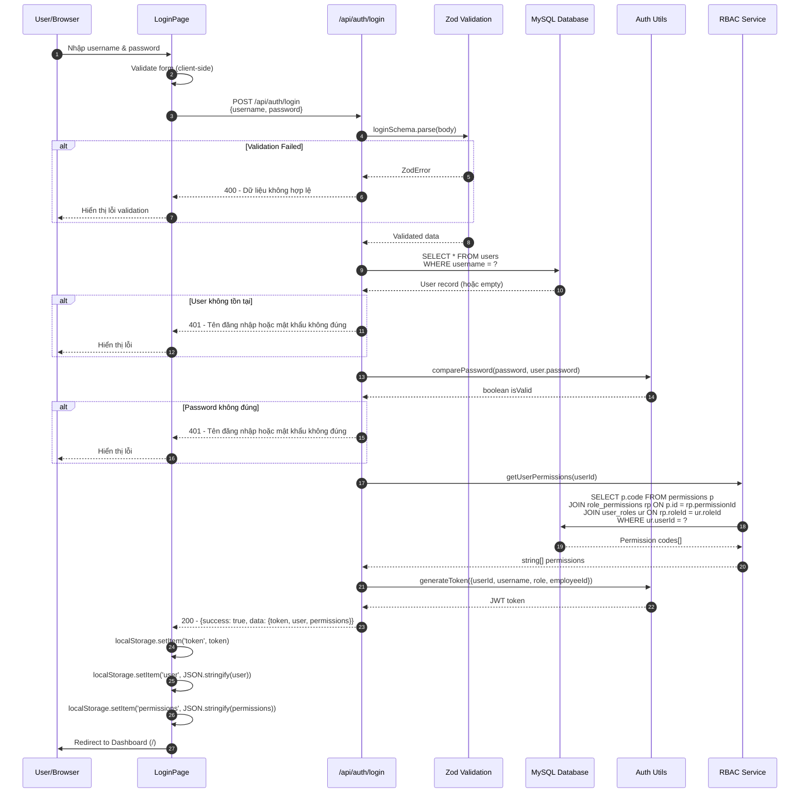
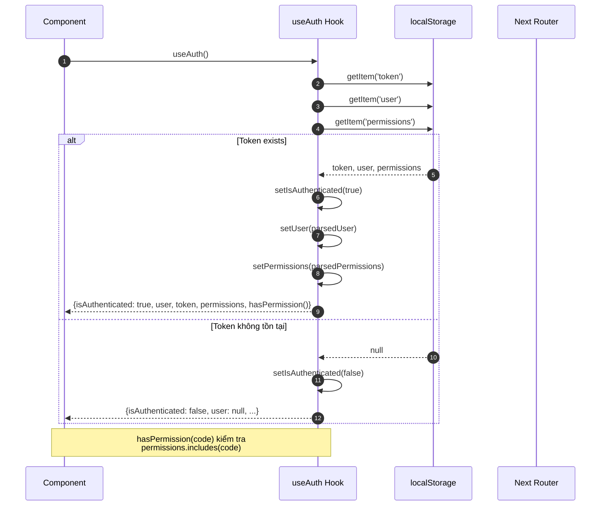
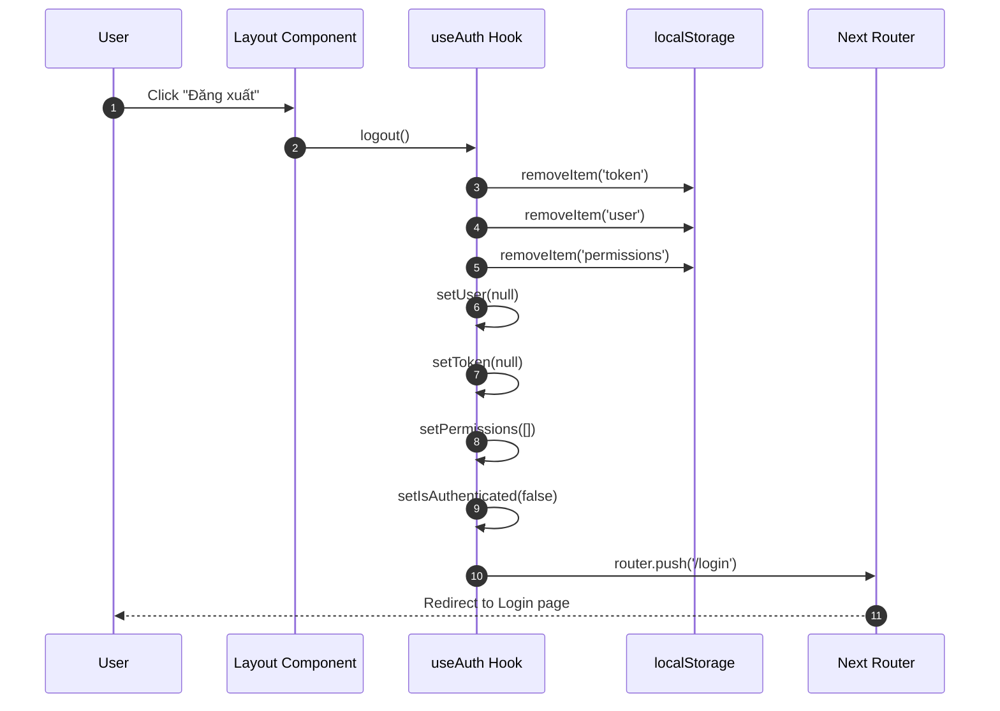
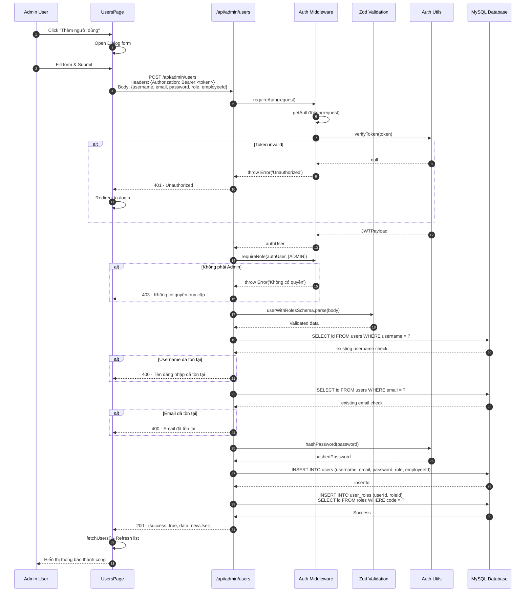
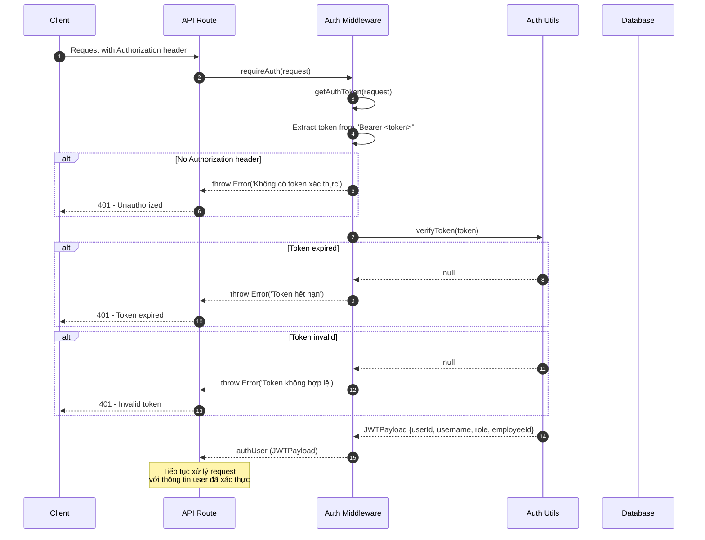
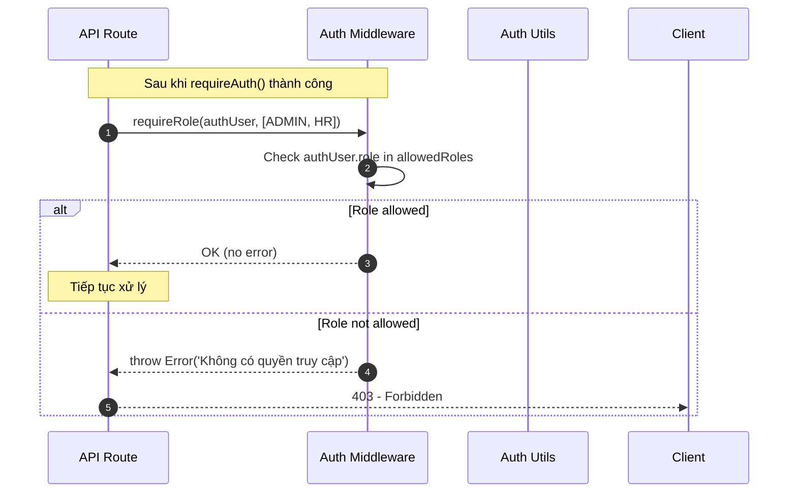
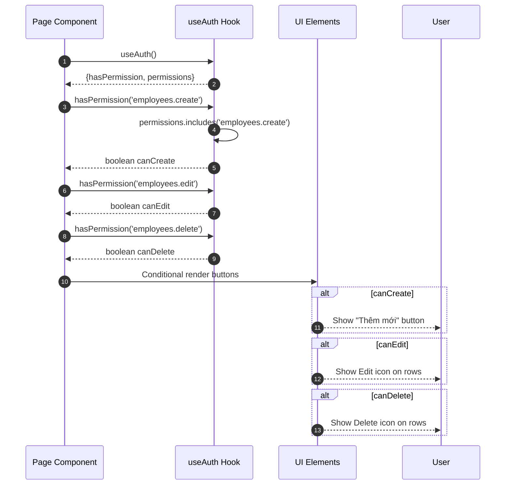

# Sequence Diagram - Authentication Module

## 1.1 Đăng nhập (Login)

## 1.2 Kiểm tra Authentication (useAuth Hook)

## 1.3 Đăng xuất (Logout)

## 1.4 Đăng ký User mới (Admin/HR only)

## 1.5 Auth Middleware Flow

## 1.6 Role-based Access Control Flow

## 1.7 Permission-based Access Control (Client-side)

