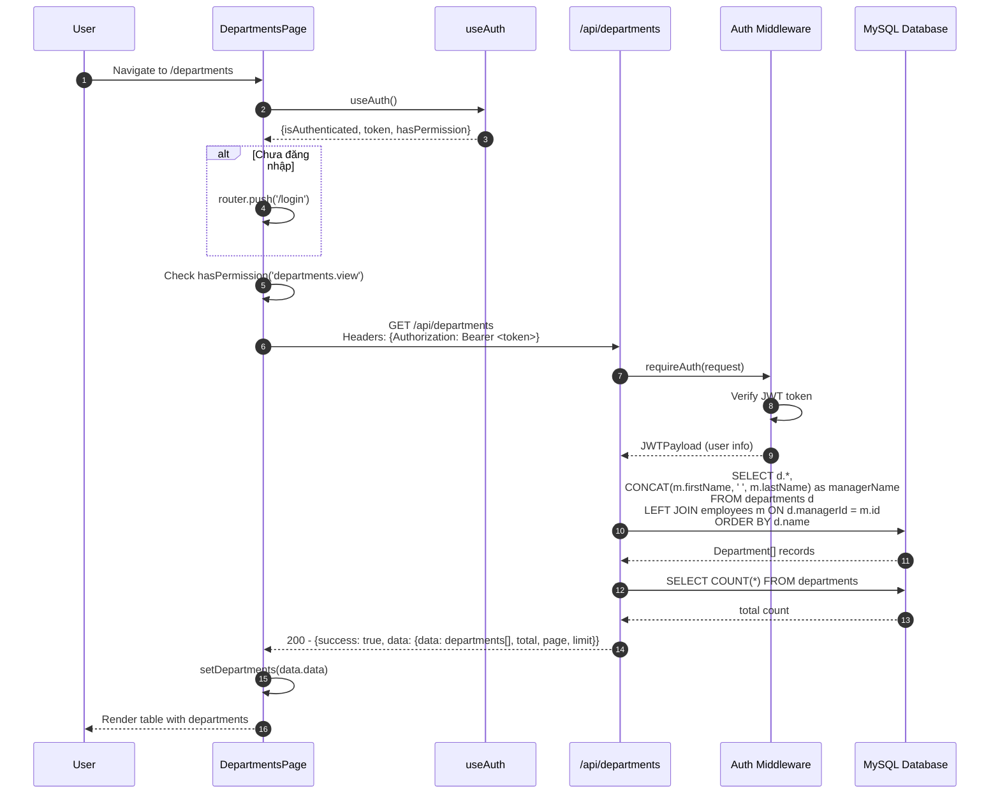
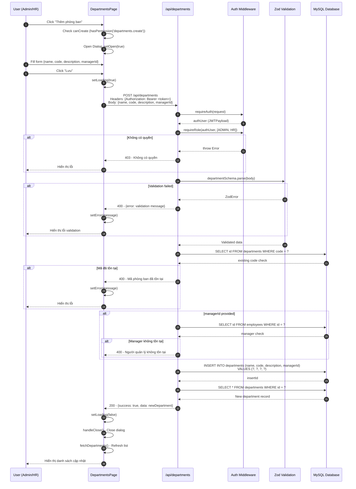
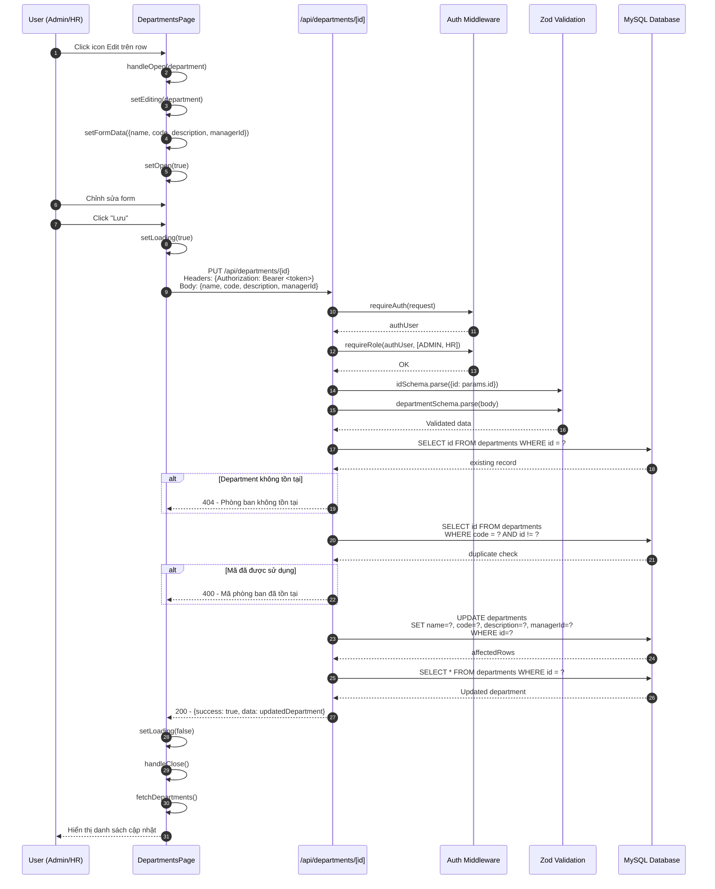
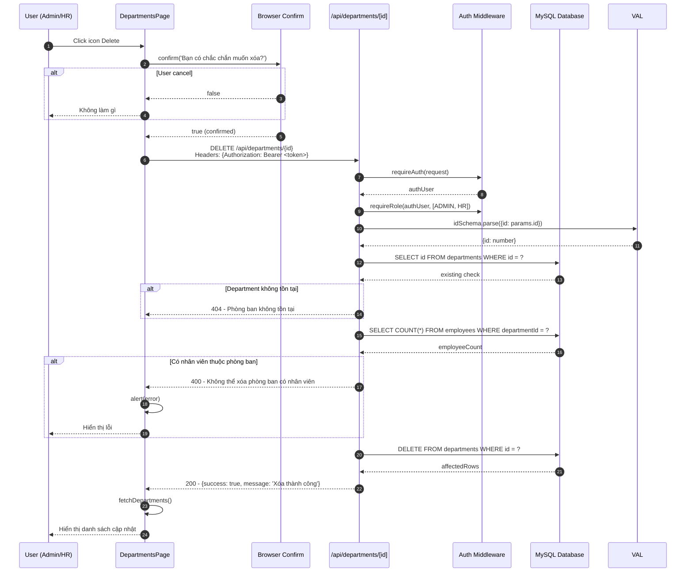
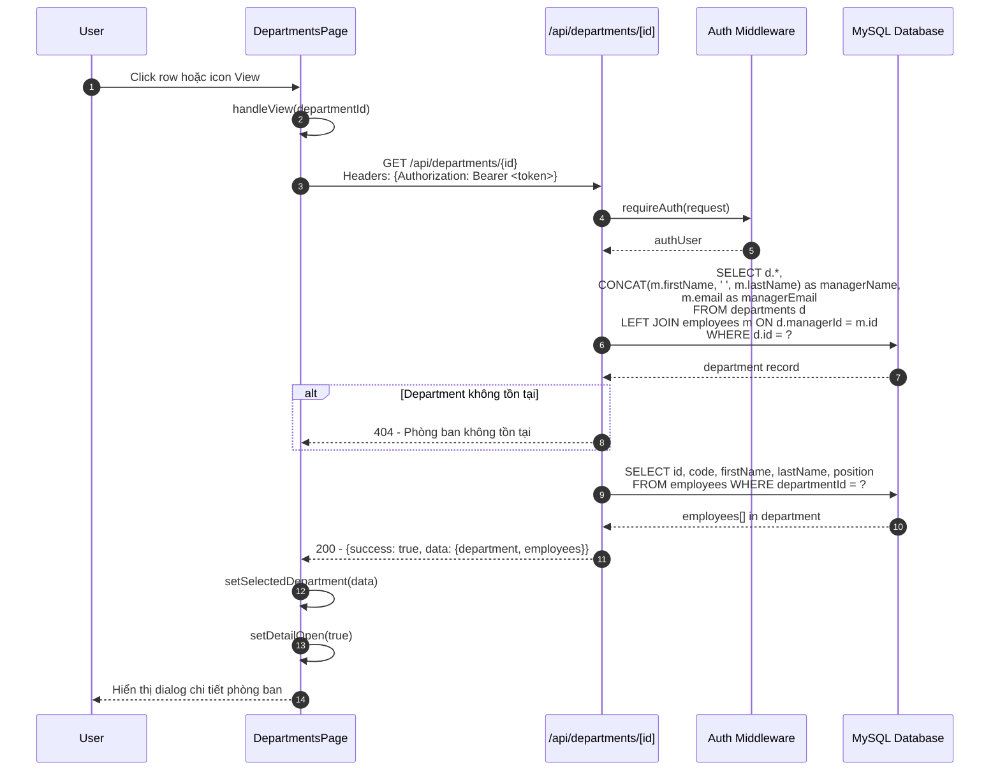
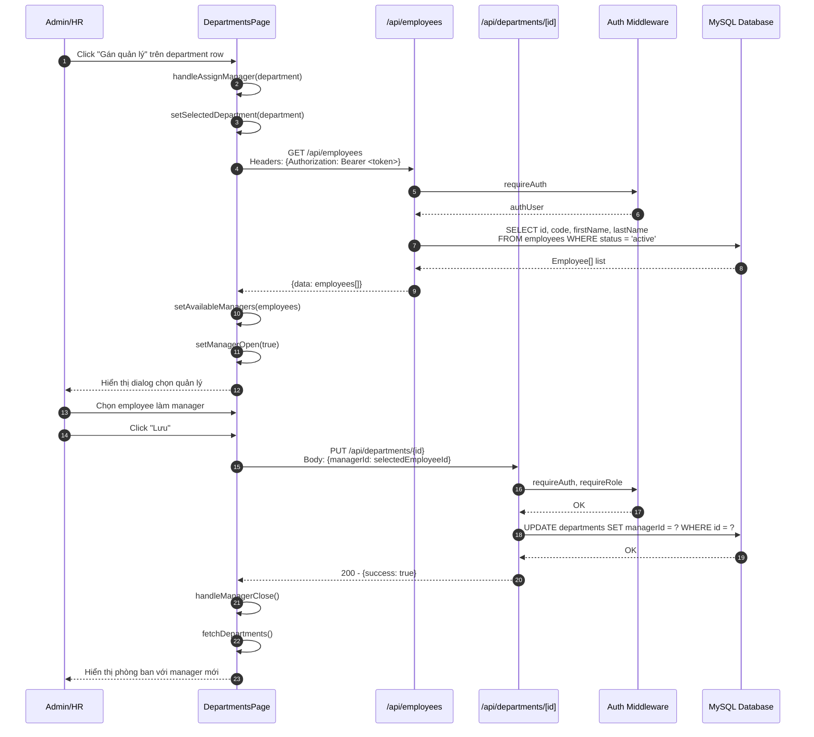

# Sequence Diagram - Department Module

## 2.1 Xem danh sách Phòng ban

## 2.2 Thêm Phòng ban mới

## 2.3 Sửa Phòng ban

## 2.4 Xóa Phòng ban

## 2.5 Xem chi tiết Phòng ban

## 2.6 Gán Quản lý cho Phòng ban

