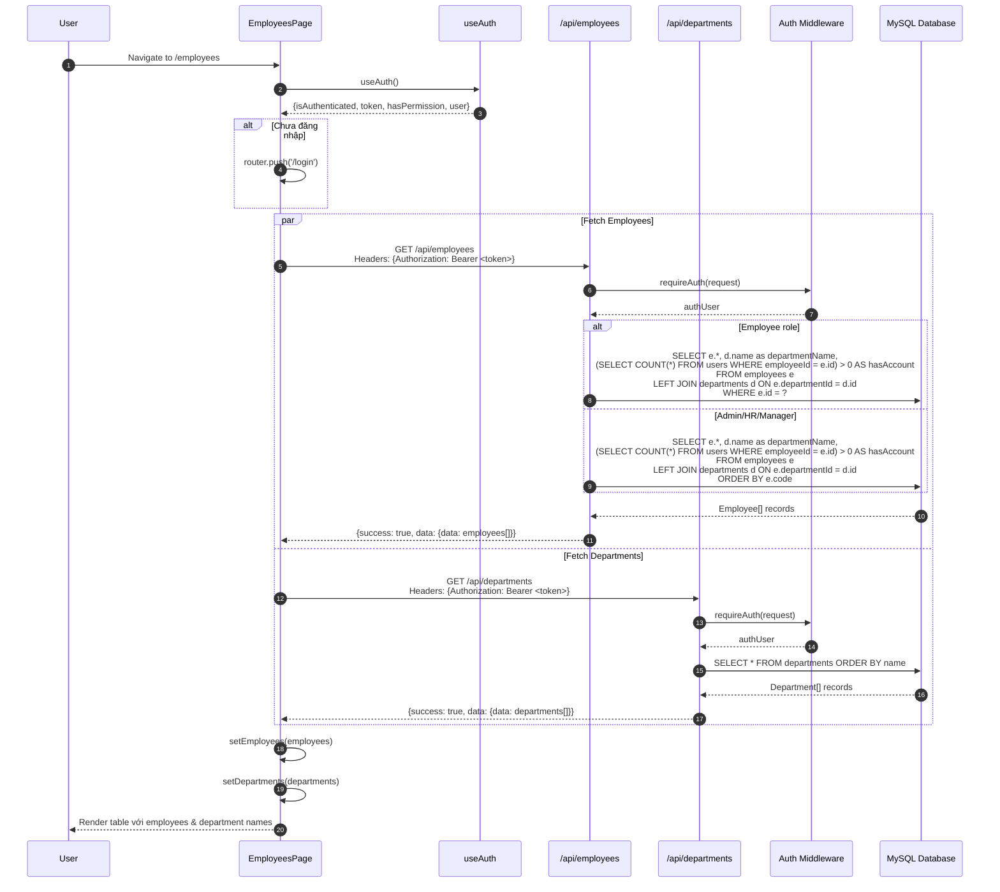
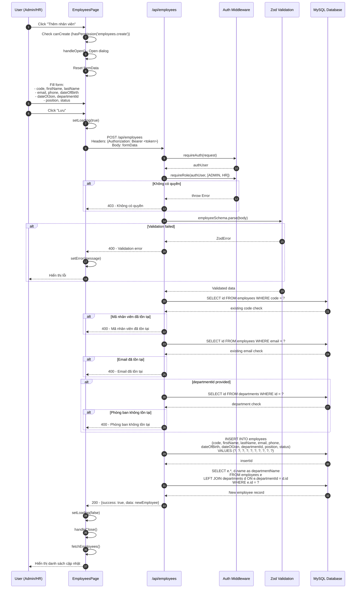
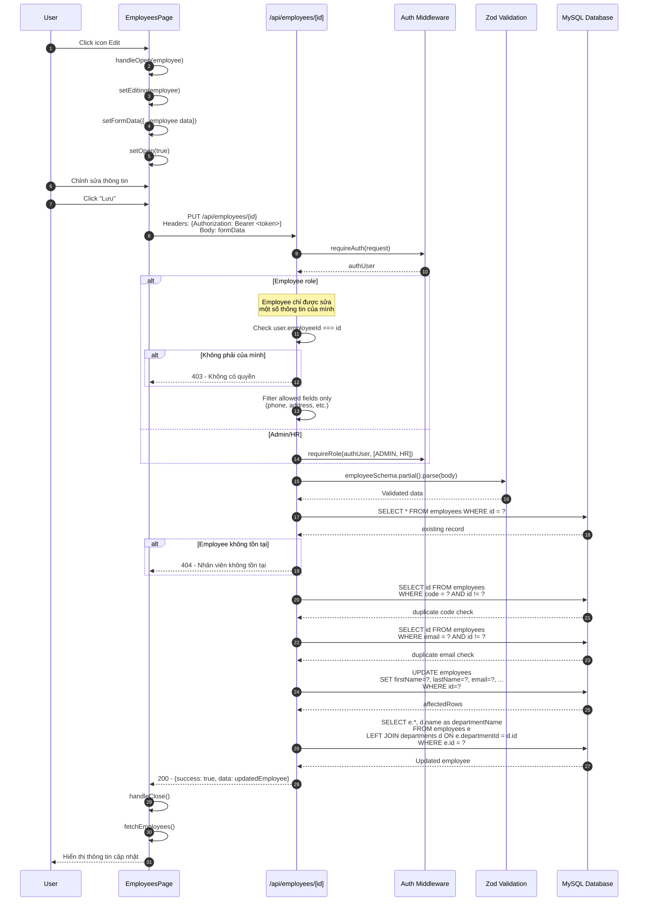
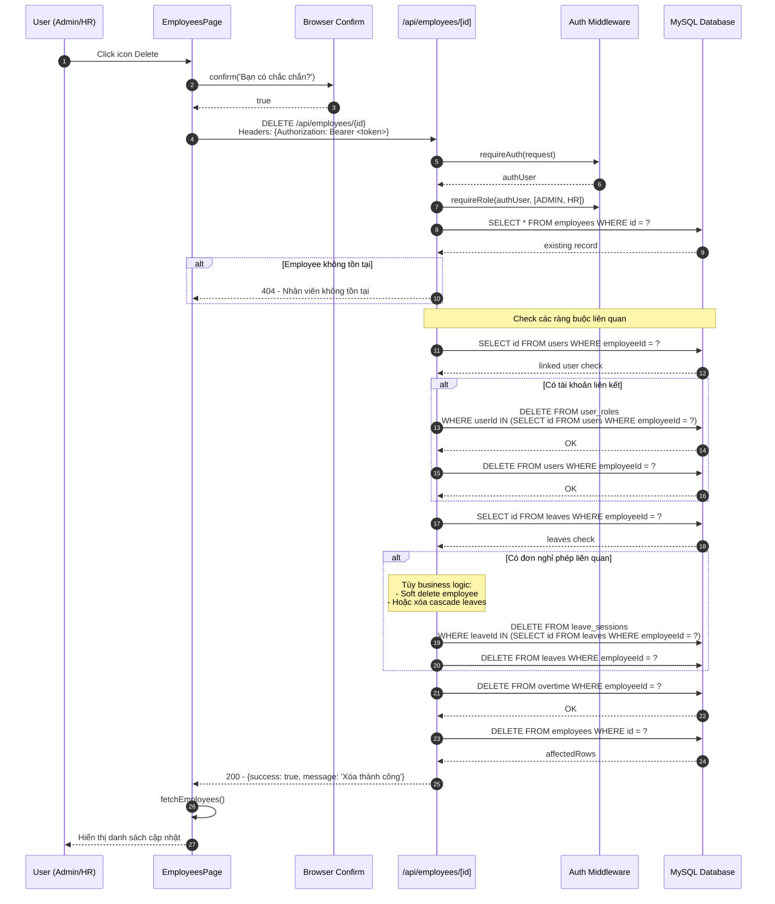
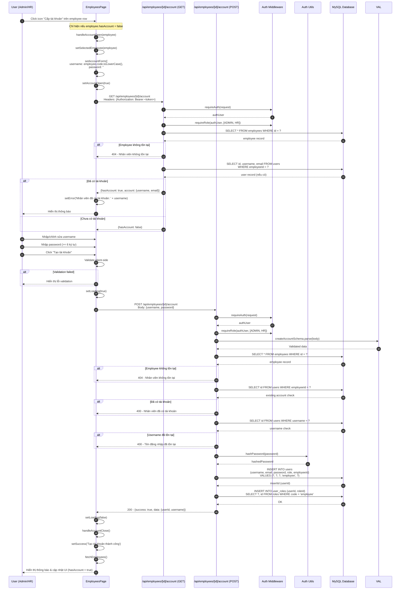
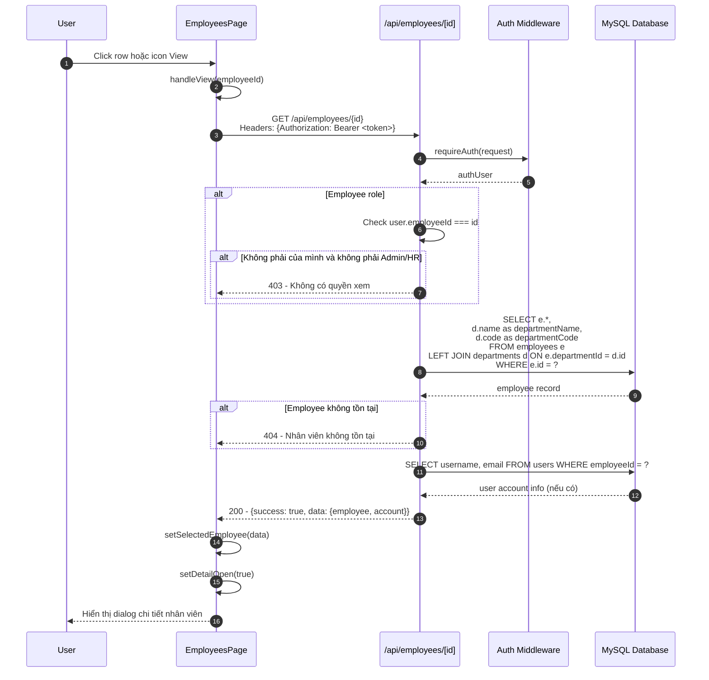
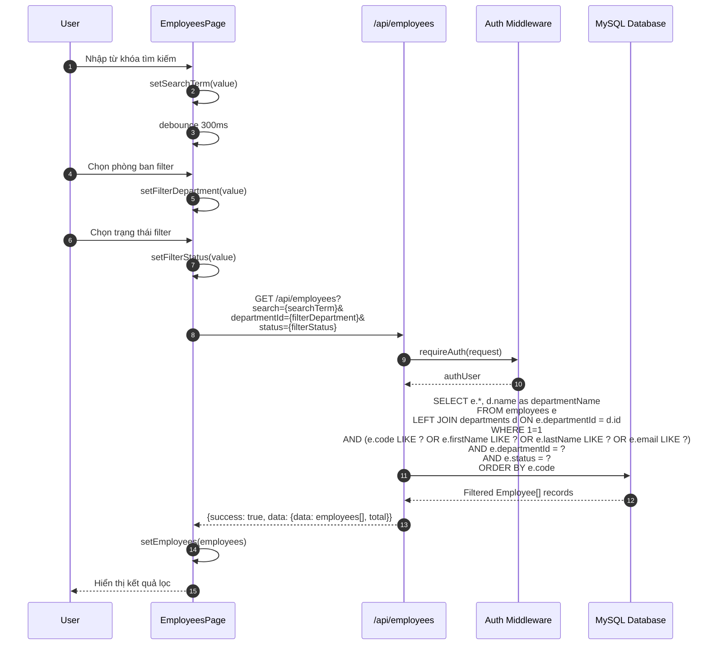

# Sequence Diagram - Employee Module

## 3.1 Xem danh sách Nhân viên



## 3.2 Thêm Nhân viên mới



## 3.3 Sửa thông tin Nhân viên



## 3.4 Xóa Nhân viên



## 3.5 Cấp tài khoản cho Nhân viên



## 3.6 Xem chi tiết Nhân viên



## 3.7 Tìm kiếm và Lọc Nhân viên



## 3.8 Xuất danh sách Nhân viên (Export)

```mermaid
sequenceDiagram
    autonumber
    participant U as User (Admin/HR)
    participant Page as EmployeesPage
    participant API as /api/employees/export
    participant MW as Auth Middleware
    participant DB as MySQL Database

    U->>Page: Click "Xuất Excel"
    Page->>Page: Check hasPermission('employees.export')
    
    Page->>API: GET /api/employees/export<br/>Headers: {Authorization: Bearer <token>}
    
    API->>MW: requireAuth(request)
    MW-->>API: authUser
    API->>MW: requireRole(authUser, [ADMIN, HR])
    
    API->>DB: SELECT e.code, e.firstName, e.lastName,<br/>e.email, e.phone, e.dateOfBirth, e.dateOfJoin,<br/>d.name as departmentName, e.position, e.status<br/>FROM employees e<br/>LEFT JOIN departments d ON e.departmentId = d.id<br/>ORDER BY e.code
    DB-->>API: All employees data
    
    API->>API: Generate Excel/CSV file
    API->>API: Set Content-Type: application/vnd.openxmlformats-officedocument.spreadsheetml.sheet
    API->>API: Set Content-Disposition: attachment; filename="employees.xlsx"
    
    API-->>Page: Binary file stream
    
    Page->>Page: Create download link
    Page->>Page: Trigger download
    Page-->>U: Download file employees.xlsx
```
