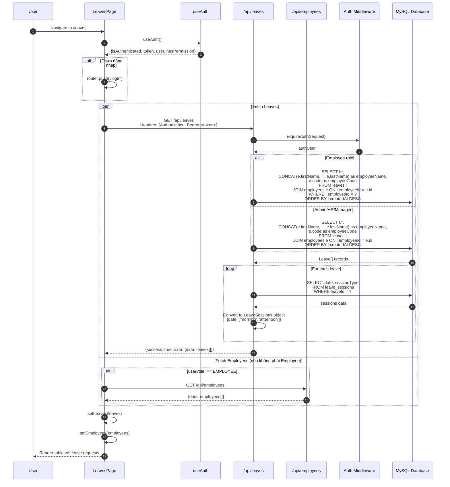
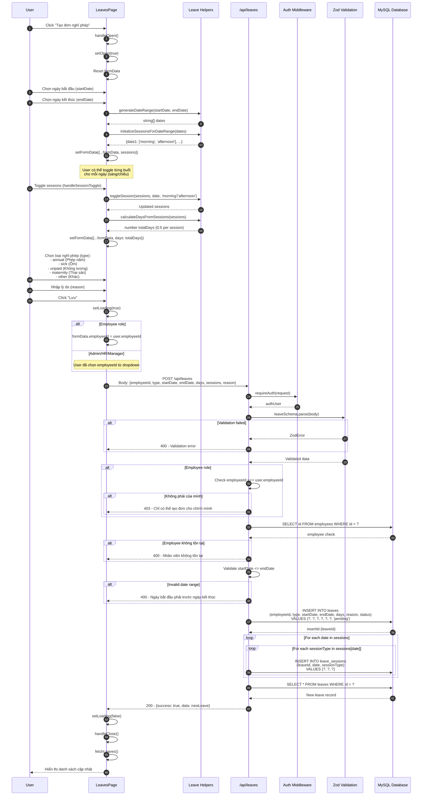
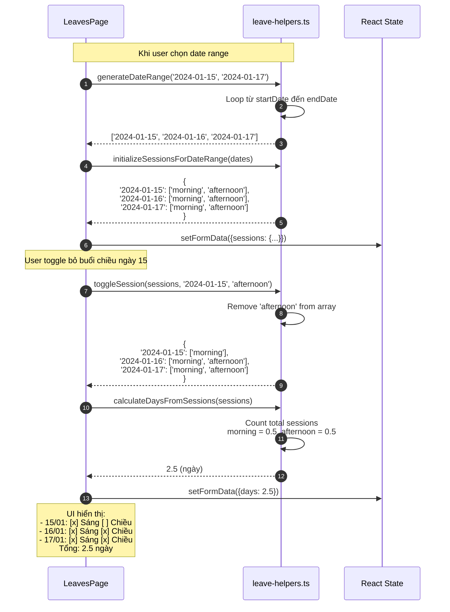
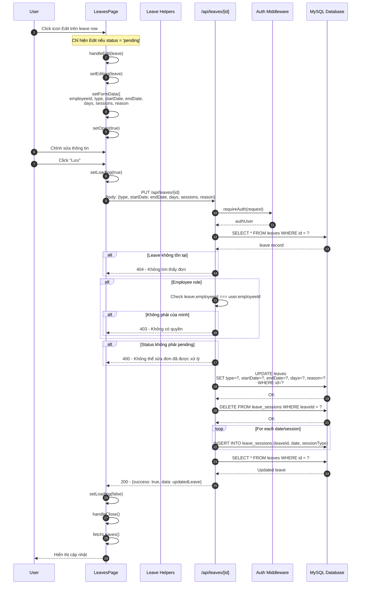
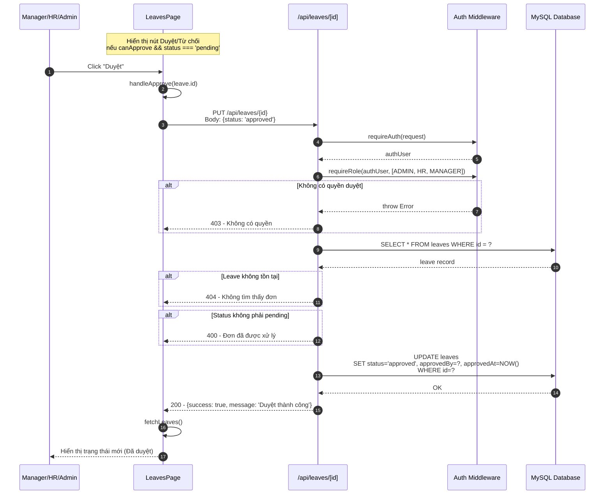
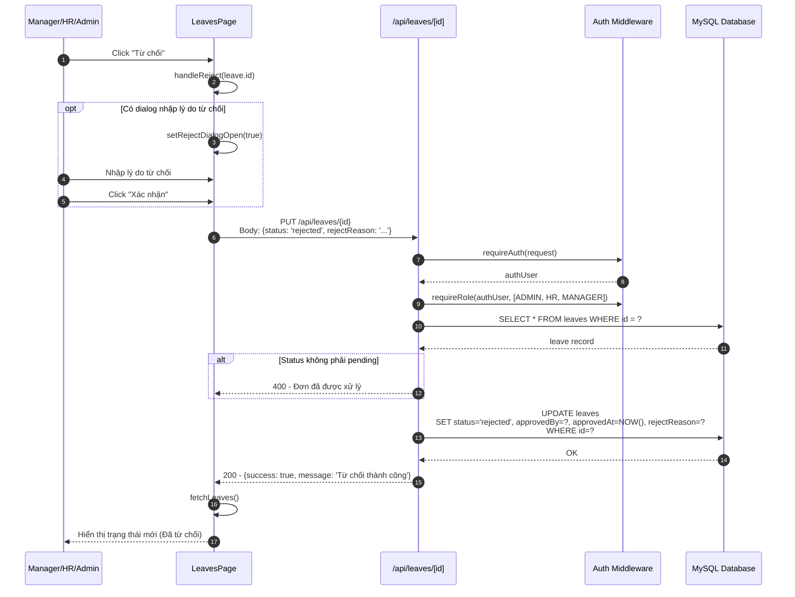
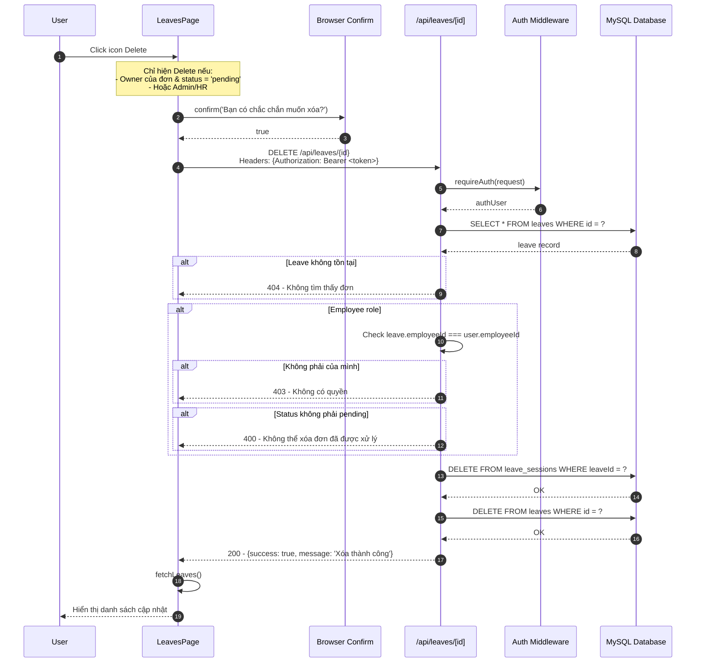
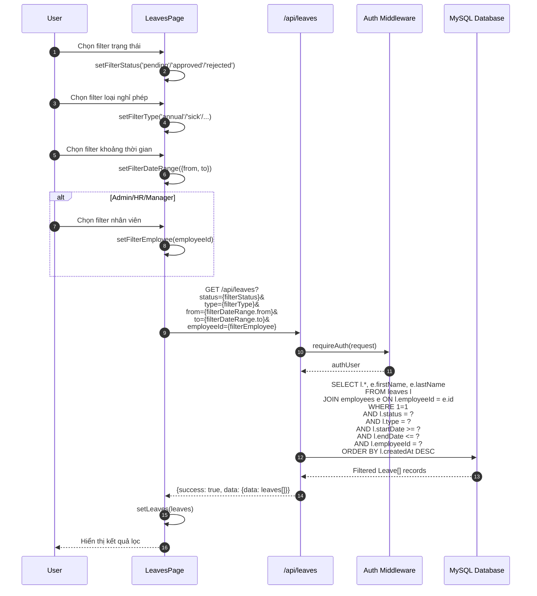
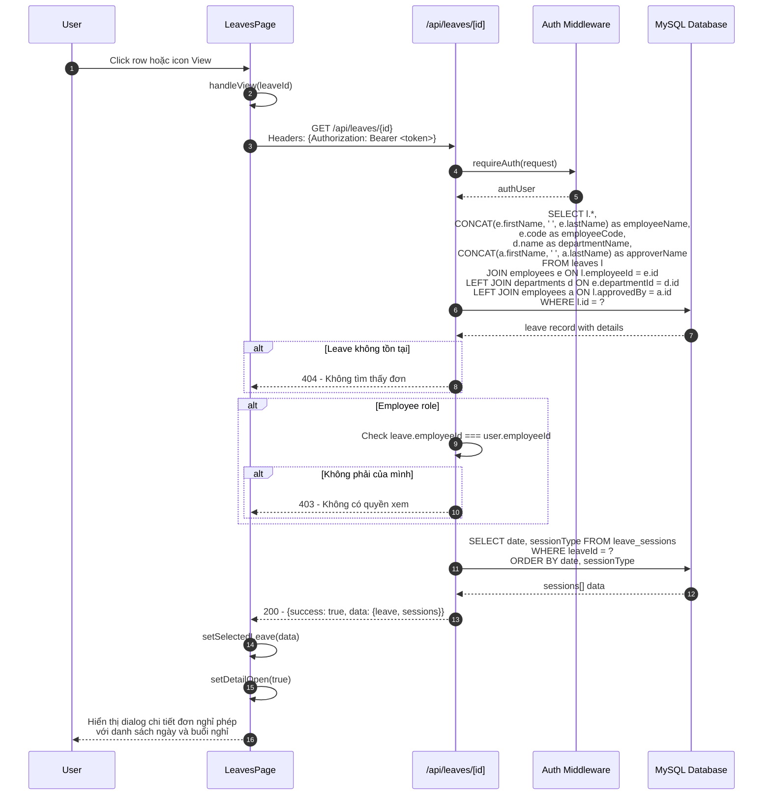

# Sequence Diagram - Leave Module (Nghỉ phép)

## 4.1 Xem danh sách Đơn nghỉ phép

## 4.2 Tạo Đơn nghỉ phép mới

## 4.3 Chi tiết xử lý Sessions (Half-day leave)

## 4.4 Sửa Đơn nghỉ phép (chỉ khi pending)

## 4.5 Duyệt Đơn nghỉ phép

## 4.6 Từ chối Đơn nghỉ phép

## 4.7 Xóa Đơn nghỉ phép

## 4.8 Lọc và Tìm kiếm Đơn nghỉ phép

## 4.9 Xem chi tiết Đơn nghỉ phép

