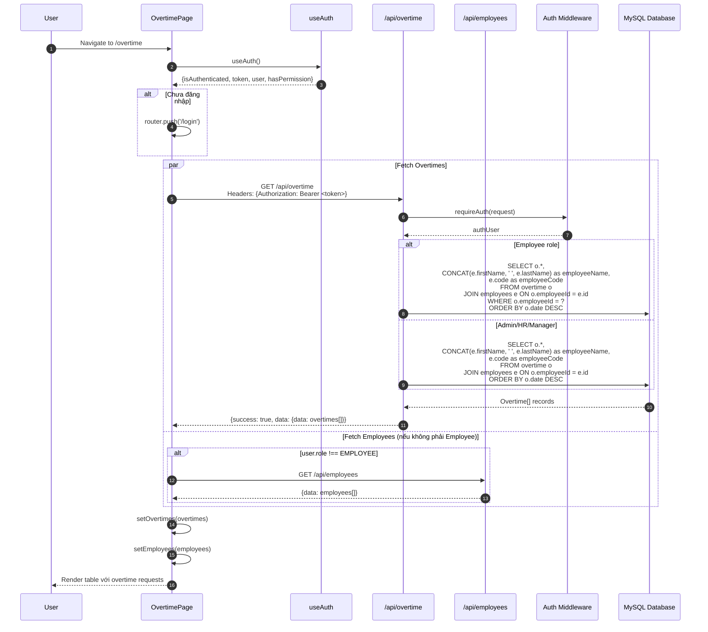
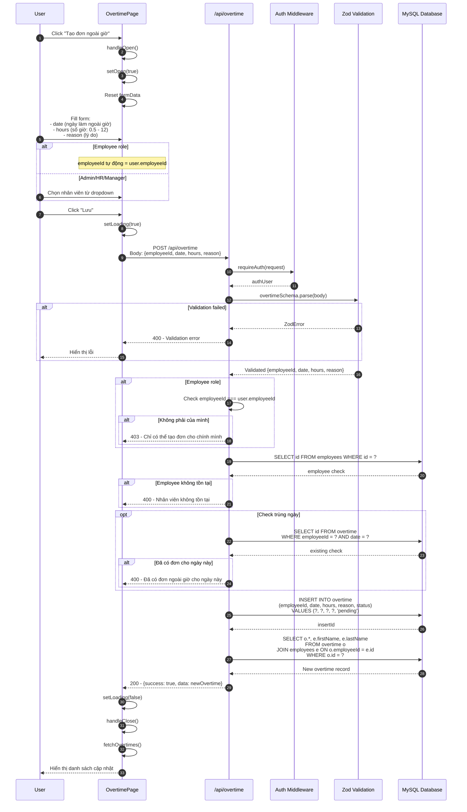
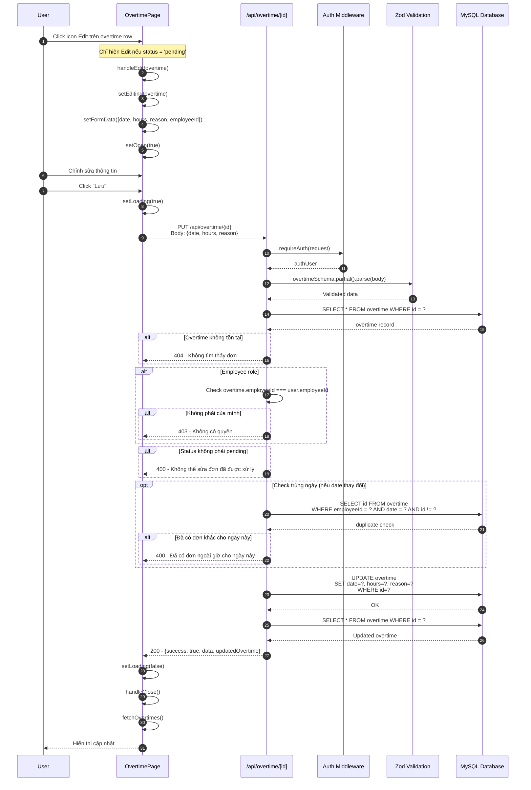
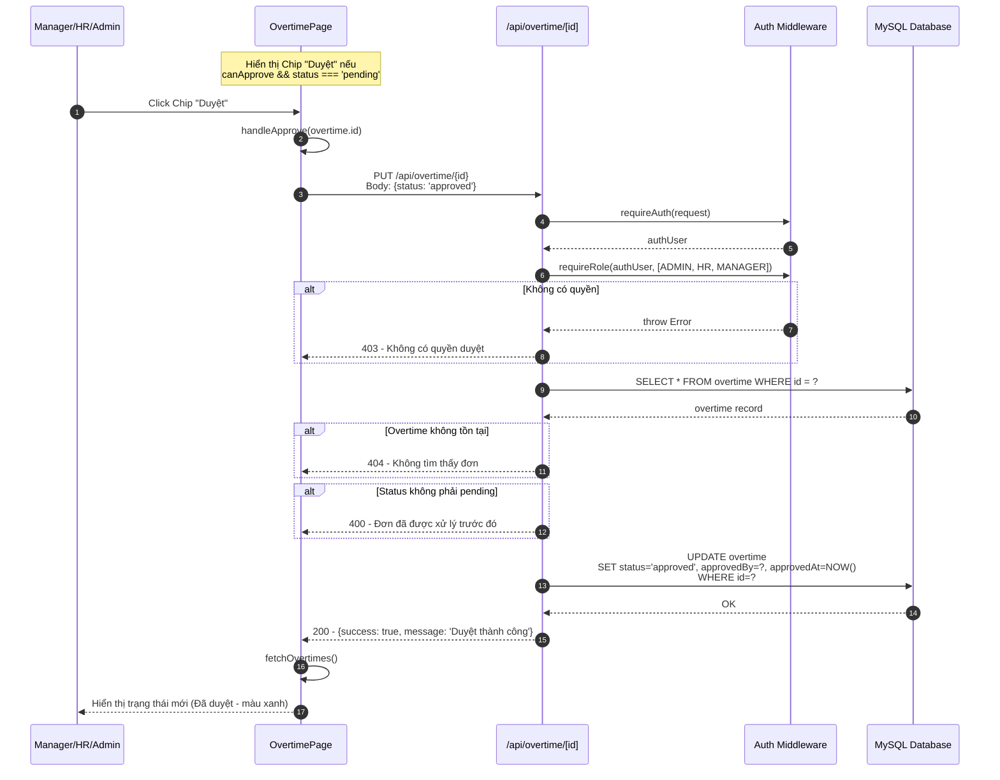
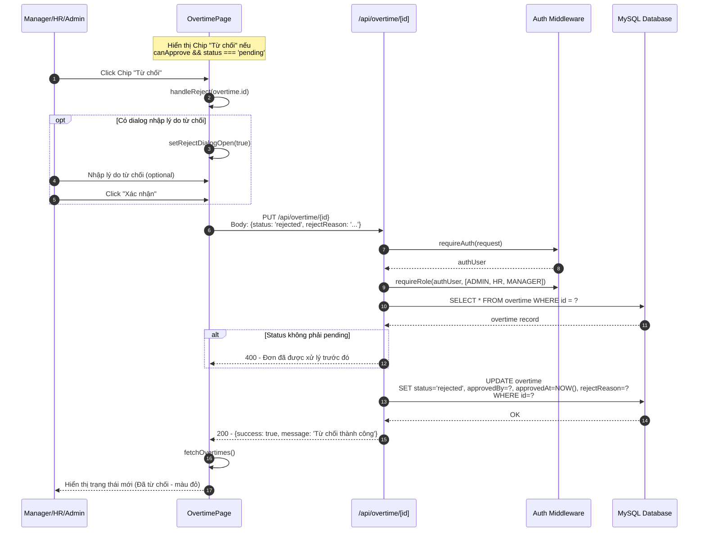
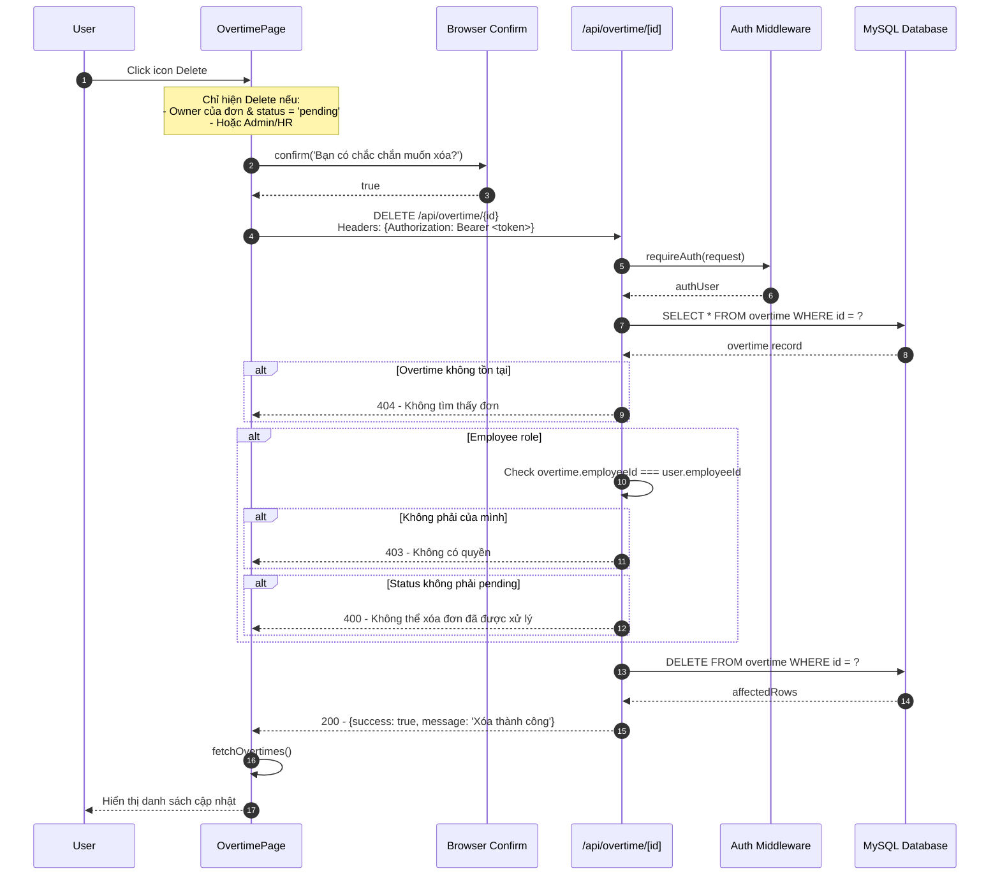
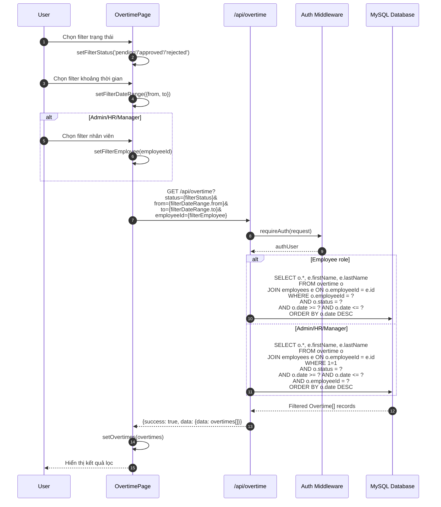
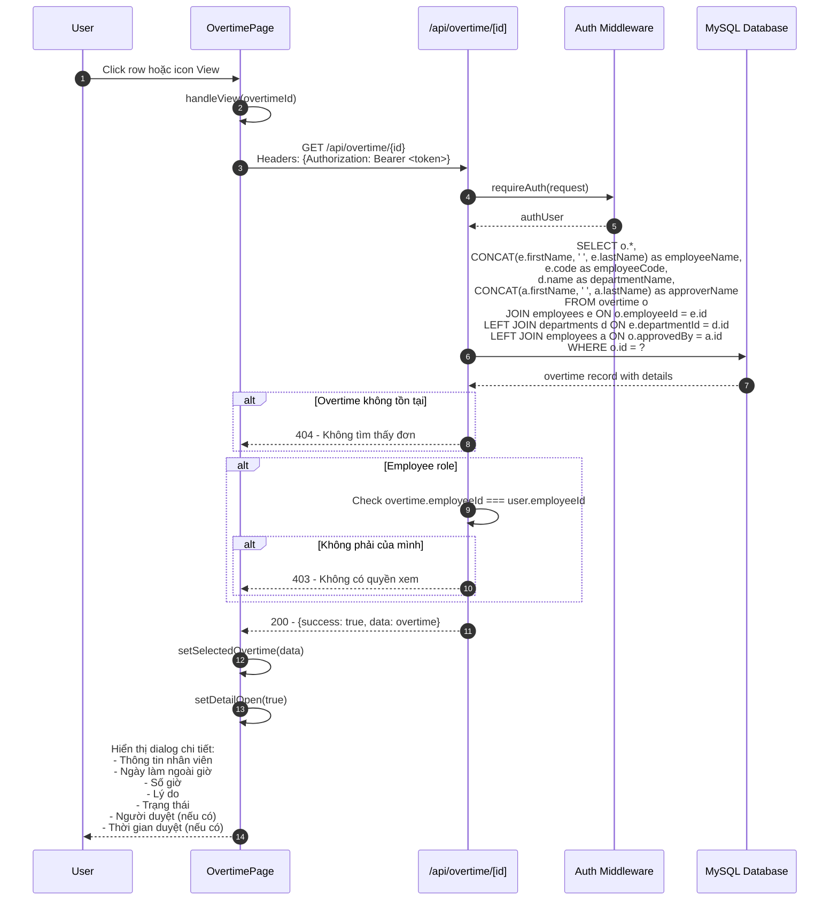
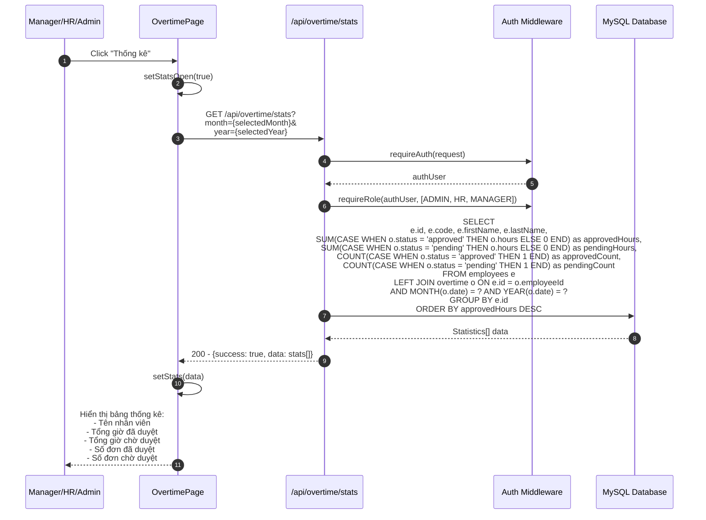

# Sequence Diagram - Overtime Module (Làm ngoài giờ)

## 5.1 Xem danh sách Đơn ngoài giờ

## 5.2 Tạo Đơn ngoài giờ mới

## 5.3 Sửa Đơn ngoài giờ

## 5.4 Duyệt Đơn ngoài giờ

## 5.5 Từ chối Đơn ngoài giờ

## 5.6 Xóa Đơn ngoài giờ

## 5.7 Lọc và Tìm kiếm Đơn ngoài giờ

## 5.8 Xem chi tiết Đơn ngoài giờ

## 5.9 Thống kê Giờ làm thêm

