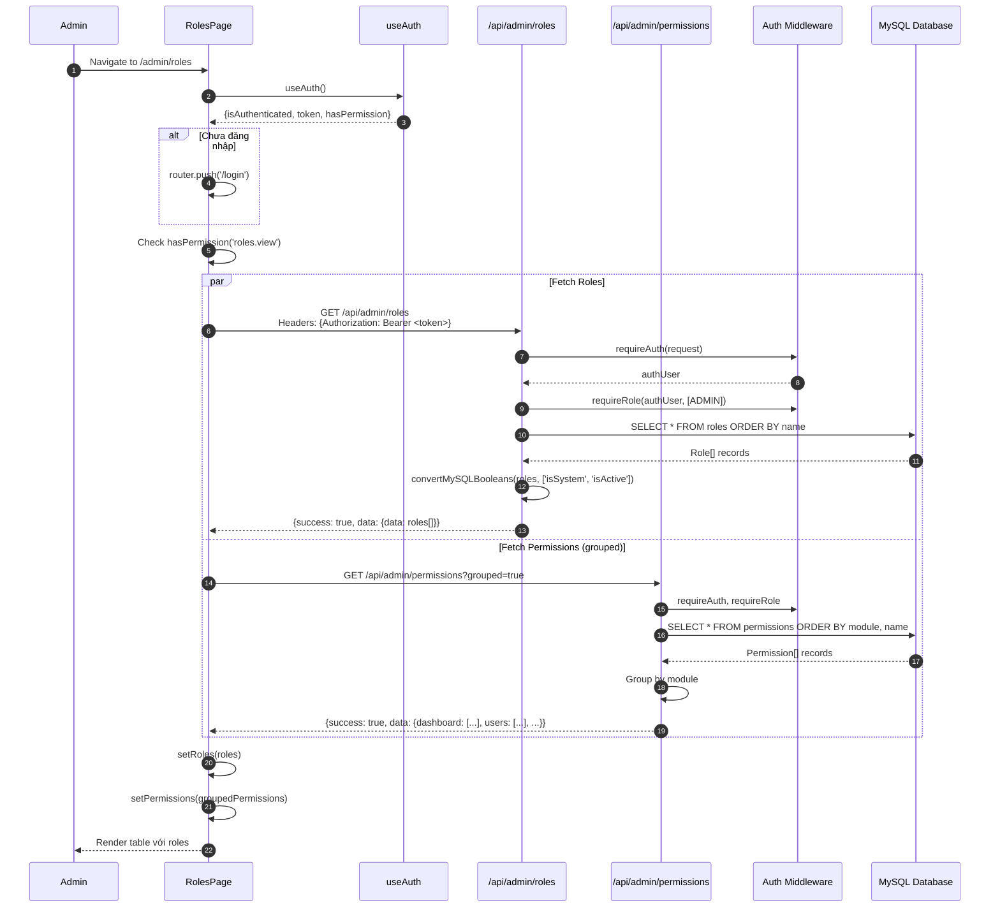
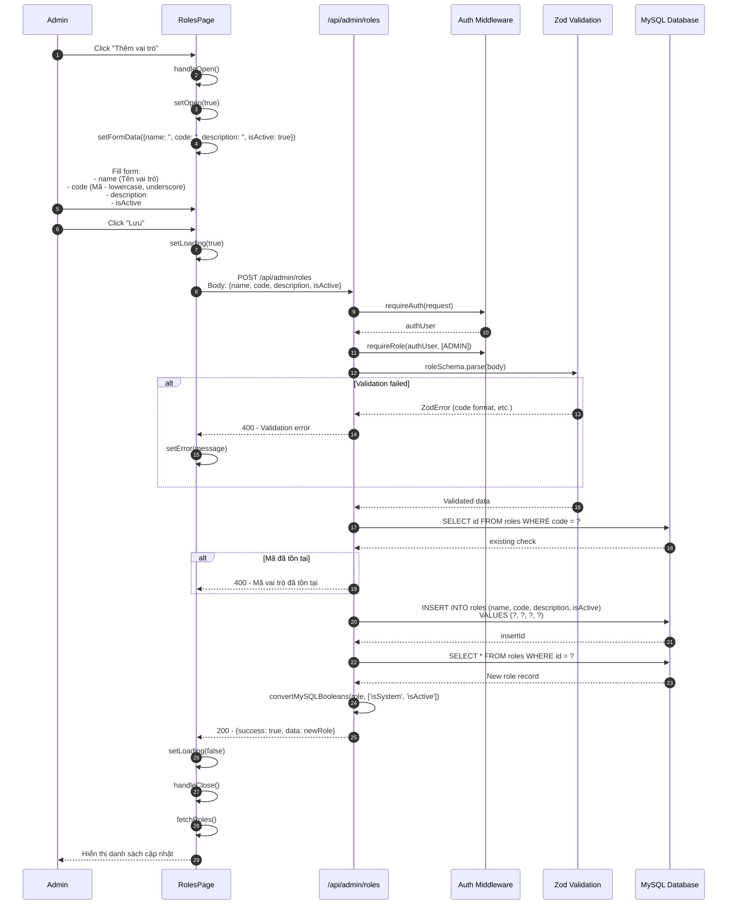
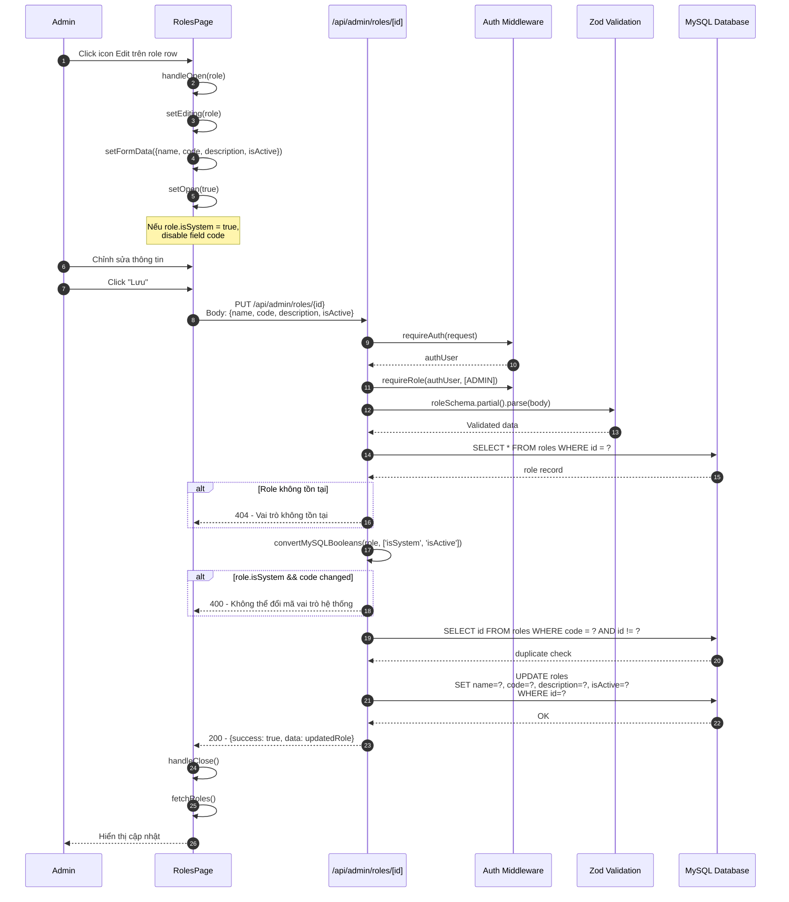
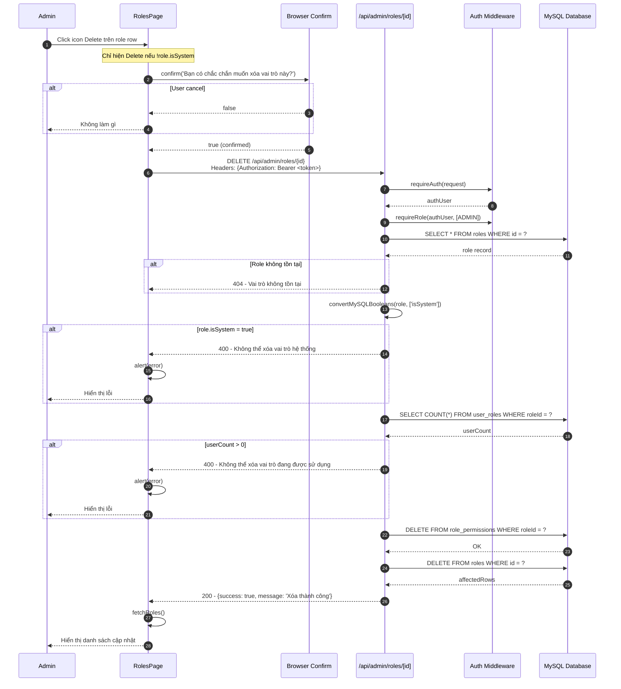
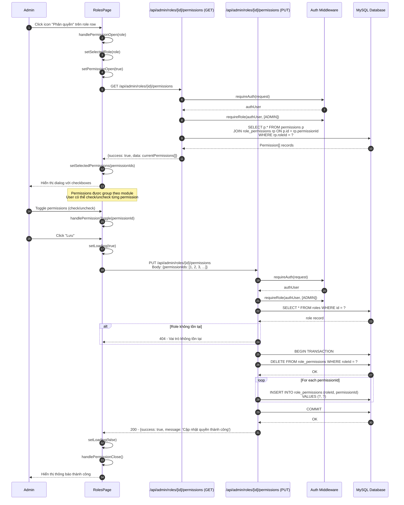
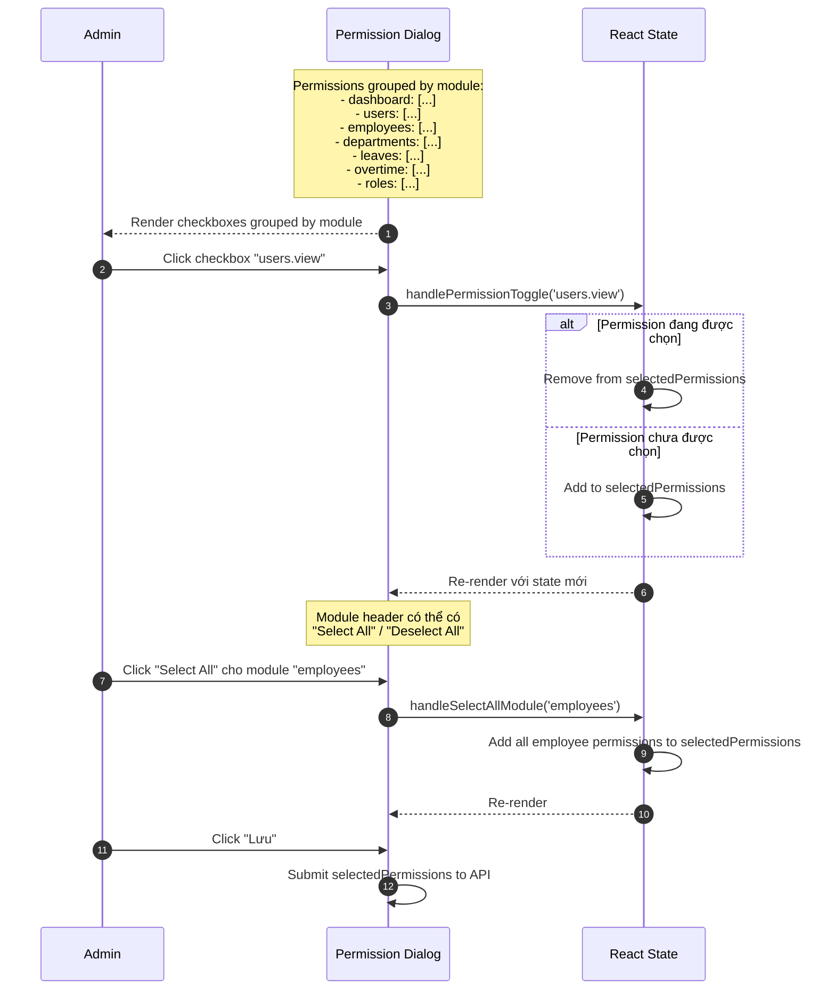

# Sequence Diagram - RBAC Roles Module

## 6.1 Xem danh sách Vai trò

## 6.2 Thêm Vai trò mới

## 6.3 Sửa Vai trò

## 6.4 Xóa Vai trò

## 6.5 Phân quyền cho Vai trò

## 6.6 Chi tiết Permission Toggle UI

