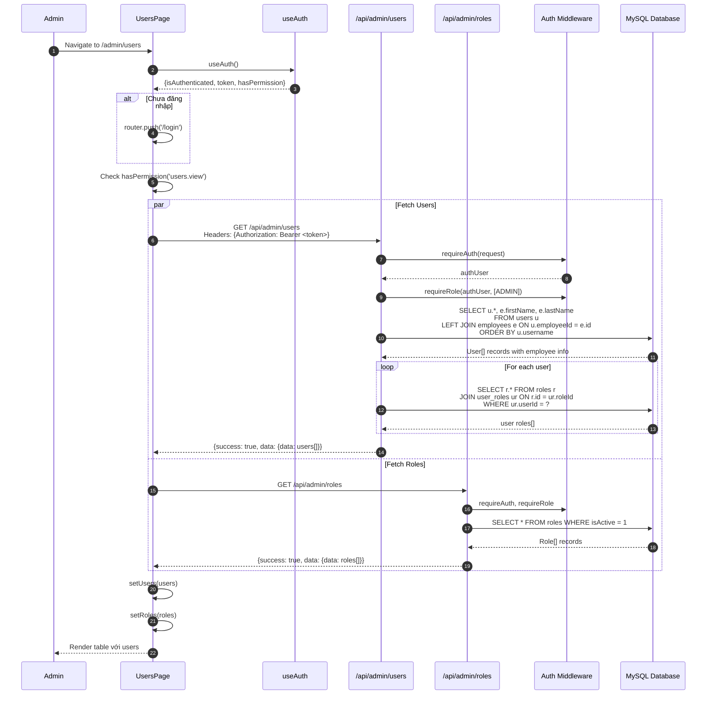
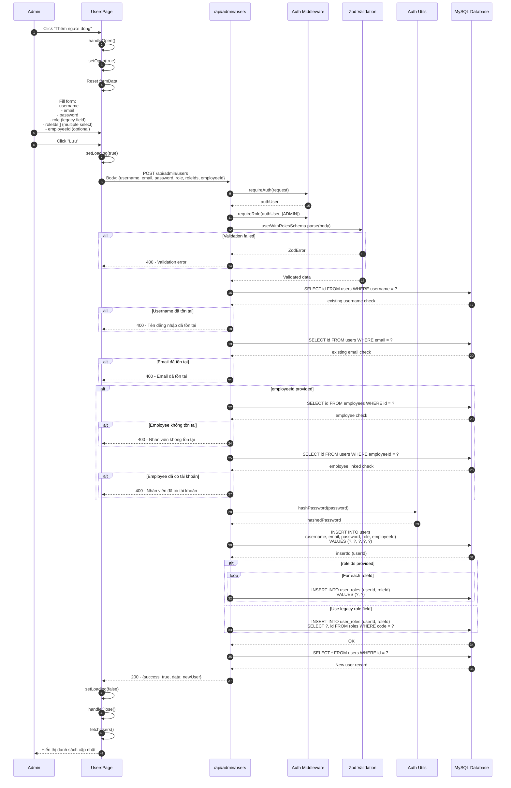
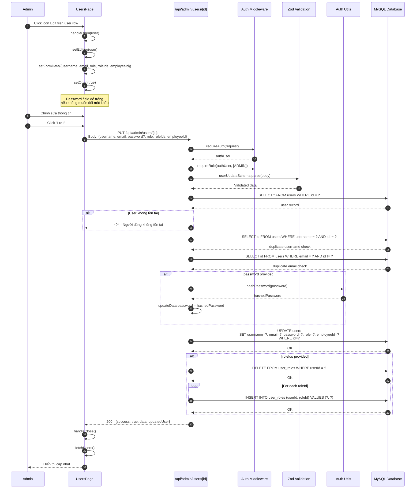
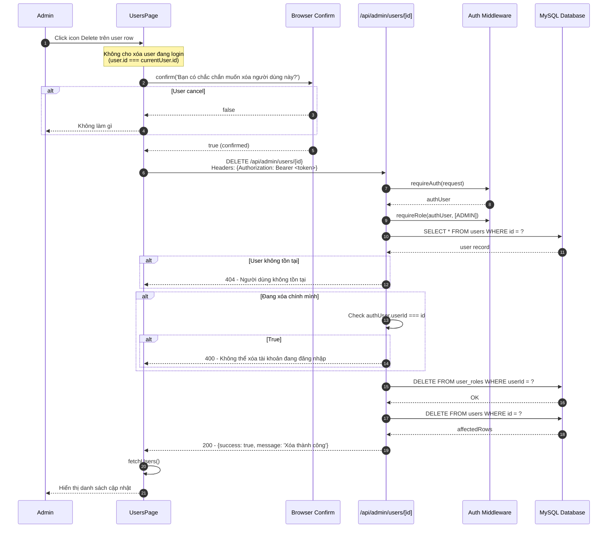
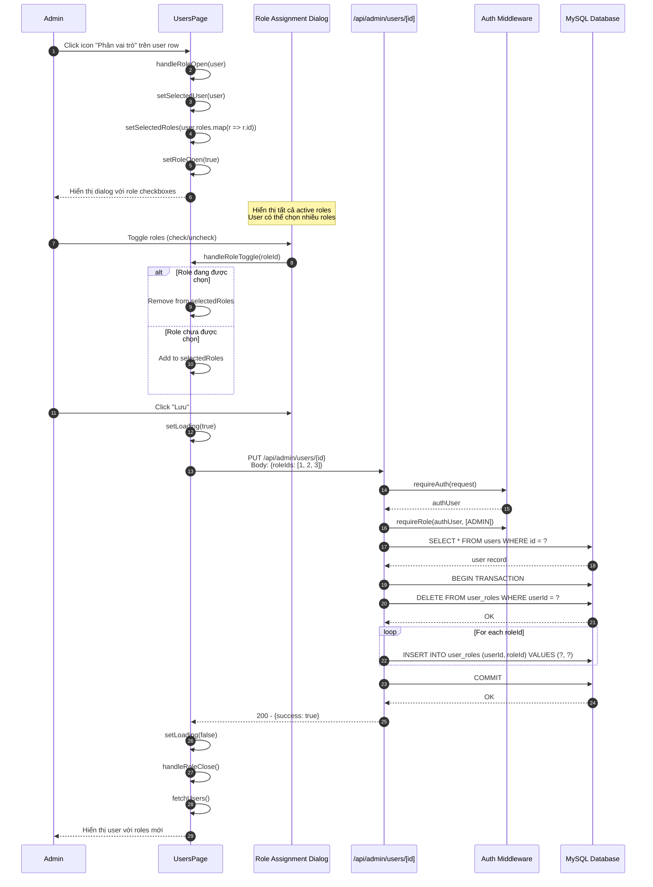
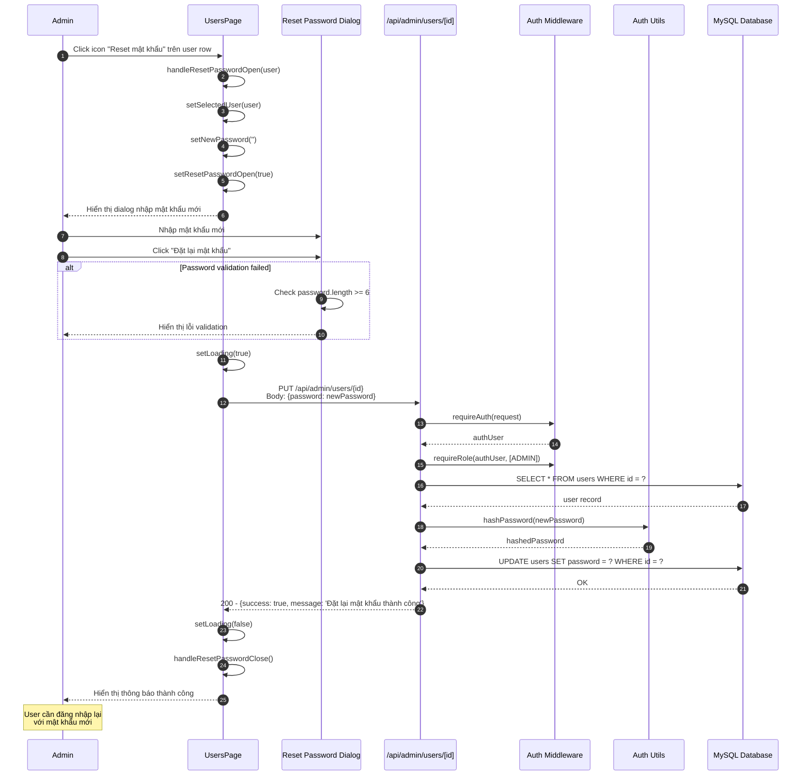

# Sequence Diagram - RBAC Users Module (Quản lý người dùng)

## 7.1 Xem danh sách Người dùng

## 7.2 Thêm Người dùng mới

## 7.3 Sửa thông tin Người dùng

## 7.4 Xóa Người dùng

## 7.5 Gán Vai trò cho Người dùng

## 7.6 Reset mật khẩu Người dùng

