# Sequence Diagram - RBAC Permissions Module

## 8.1 Xem danh sách Permissions

## 8.2 Xem Permissions theo Role

```mermaid
sequenceDiagram
    autonumber
    participant U as Admin
    participant Page as RolesPage
    participant API as /api/admin/roles/[id]/permissions
    participant MW as Auth Middleware
    participant DB as MySQL Database

    U->>Page: Click "Phân quyền" trên role row
    Page->>Page: handlePermissionOpen(role)
    Page->>Page: setSelectedRole(role)
    
    Page->>API: GET /api/admin/roles/{roleId}/permissions<br/>Headers: {Authorization: Bearer <token>}
    
    API->>MW: requireAuth(request)
    MW-->>API: authUser
    API->>MW: requireRole(authUser, [ADMIN])
    
    API->>DB: SELECT p.* FROM permissions p<br/>INNER JOIN role_permissions rp ON p.id = rp.permissionId<br/>WHERE rp.roleId = ?
    DB-->>API: Permission[] assigned to role
    
    API-->>Page: 200 - {success: true, data: rolePermissions[]}
    
    Page->>Page: setSelectedPermissions(rolePermissions.map(p => p.id))
    Page->>Page: setPermissionOpen(true)
    Page-->>U: Hiển thị dialog với permissions được check
```

## 8.3 Cập nhật Permissions cho Role

```mermaid
sequenceDiagram
    autonumber
    participant U as Admin
    participant Dialog as Permission Dialog
    participant API as /api/admin/roles/[id]/permissions
    participant MW as Auth Middleware
    participant DB as MySQL Database

    Note over Dialog: Hiển thị tất cả permissions<br/>grouped by module

    U->>Dialog: Toggle permission checkboxes
    Dialog->>Dialog: handlePermissionToggle(permissionId)
    
    Note over Dialog: Update selectedPermissions state<br/>Add or remove permissionId

    U->>Dialog: Click "Lưu"
    Dialog->>Dialog: setLoading(true)
    
    Dialog->>API: PUT /api/admin/roles/{roleId}/permissions<br/>Body: {permissionIds: [1, 2, 5, 8, ...]}
    
    API->>MW: requireAuth(request)
    MW-->>API: authUser
    API->>MW: requireRole(authUser, [ADMIN])
    
    API->>DB: SELECT * FROM roles WHERE id = ?
    DB-->>API: role record
    
    alt Role không tồn tại
        API-->>Dialog: 404 - Vai trò không tồn tại
    end
    
    API->>DB: BEGIN TRANSACTION
    
    API->>DB: DELETE FROM role_permissions WHERE roleId = ?
    DB-->>API: OK - Clear old permissions
    
    loop For each permissionId in permissionIds
        API->>DB: SELECT id FROM permissions WHERE id = ?
        DB-->>API: permission exists check
        
        alt Permission tồn tại
            API->>DB: INSERT INTO role_permissions (roleId, permissionId)<br/>VALUES (?, ?)
            DB-->>API: OK
        end
    end
    
    API->>DB: COMMIT
    DB-->>API: Transaction committed
    
    API-->>Dialog: 200 - {success: true, message: 'Cập nhật quyền thành công'}
    
    Dialog->>Dialog: setLoading(false)
    Dialog->>Dialog: handlePermissionClose()
    Dialog-->>U: Hiển thị thông báo thành công
```

## 8.4 Chi tiết Permission Toggle UI

## 8.5 Permission Structure

```mermaid
sequenceDiagram
    autonumber
    participant DB as Database
    participant API as API
    participant UI as UI Component

    Note over DB: Permission table structure:<br/>- id: INT (PK)<br/>- code: VARCHAR (unique)<br/>- name: VARCHAR<br/>- description: VARCHAR<br/>- module: VARCHAR

    DB-->>API: Sample permissions data

    Note over API: Permission codes follow pattern:<br/>{module}.{action}

    API-->>UI: Grouped permissions

    Note over UI: Module Groups:<br/>━━━━━━━━━━━━━━<br/>📊 Dashboard<br/>  └ dashboard.view<br/><br/>👥 Users<br/>  ├ users.view<br/>  ├ users.create<br/>  ├ users.edit<br/>  └ users.delete<br/><br/>👤 Employees<br/>  ├ employees.view<br/>  ├ employees.create<br/>  ├ employees.edit<br/>  └ employees.delete<br/><br/>🏢 Departments<br/>  ├ departments.view<br/>  ├ departments.create<br/>  ├ departments.edit<br/>  └ departments.delete<br/><br/>📅 Leaves<br/>  ├ leaves.view<br/>  ├ leaves.create<br/>  ├ leaves.edit<br/>  ├ leaves.delete<br/>  └ leaves.approve<br/><br/>⏰ Overtime<br/>  ├ overtime.view<br/>  ├ overtime.create<br/>  ├ overtime.edit<br/>  ├ overtime.delete<br/>  └ overtime.approve<br/><br/>🔐 Roles<br/>  ├ roles.view<br/>  ├ roles.create<br/>  ├ roles.edit<br/>  └ roles.delete
```

## 8.6 Permission Check Flow (Client-side)

```mermaid
sequenceDiagram
    autonumber
    participant Page as Page Component
    participant Hook as useAuth Hook
    participant LS as localStorage
    participant UI as UI Elements

    Page->>Hook: const { hasPermission } = useAuth()
    
    Hook->>LS: getItem('permissions')
    LS-->>Hook: JSON string of permission codes
    Hook->>Hook: Parse to string[]
    
    Page->>Hook: hasPermission('employees.create')
    Hook->>Hook: permissions.includes('employees.create')
    Hook-->>Page: boolean result
    
    Page->>Page: Conditional render based on permissions
    
    alt hasPermission('employees.create') === true
        Page->>UI: Render "Thêm nhân viên" button
    else
        Page->>UI: Hide button or show disabled
    end
    
    alt hasPermission('employees.delete') === true
        Page->>UI: Render Delete icon on each row
    else
        Page->>UI: Hide Delete icon
    end
    
    alt hasPermission('leaves.approve') === true
        Page->>UI: Render Approve/Reject buttons
    else
        Page->>UI: Hide approval actions
    end
```

## 8.7 Permission Check Flow (Server-side)

