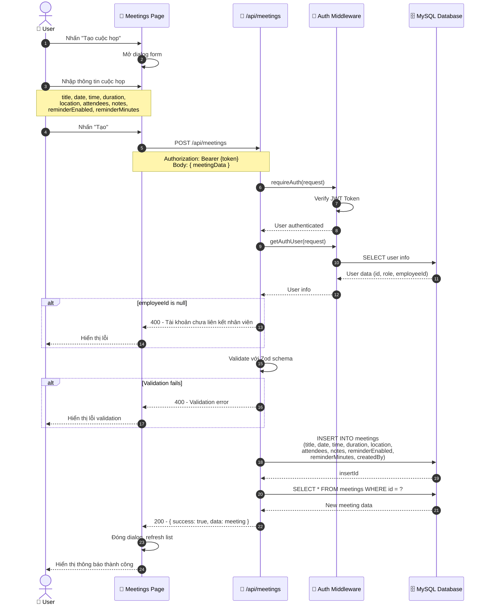
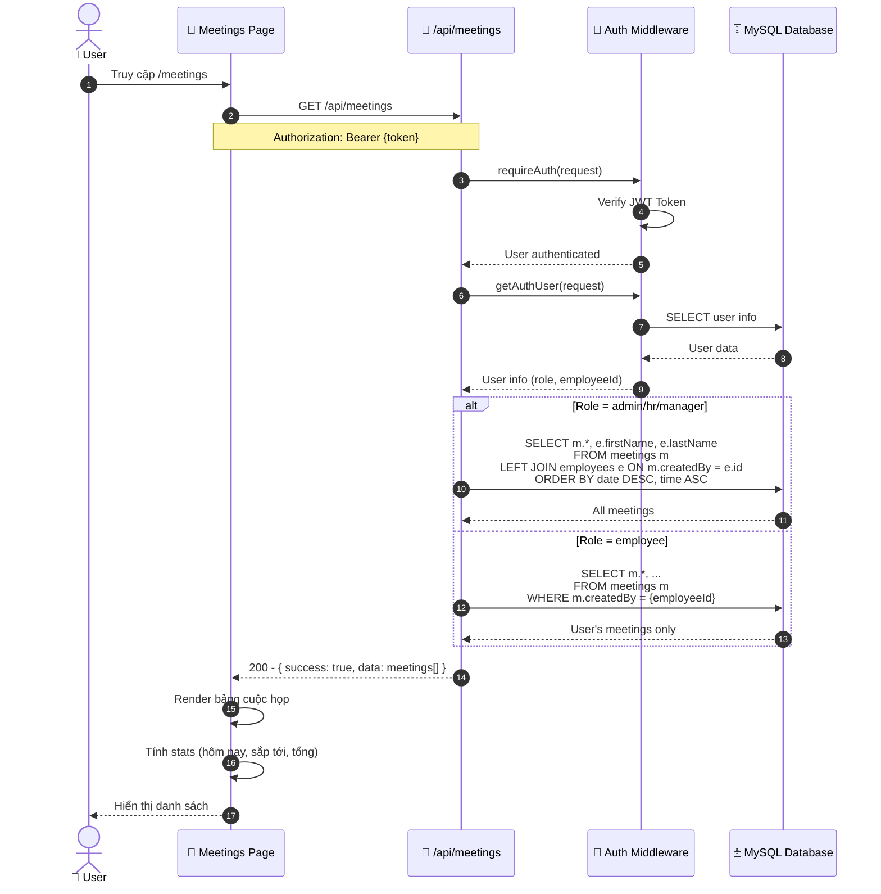
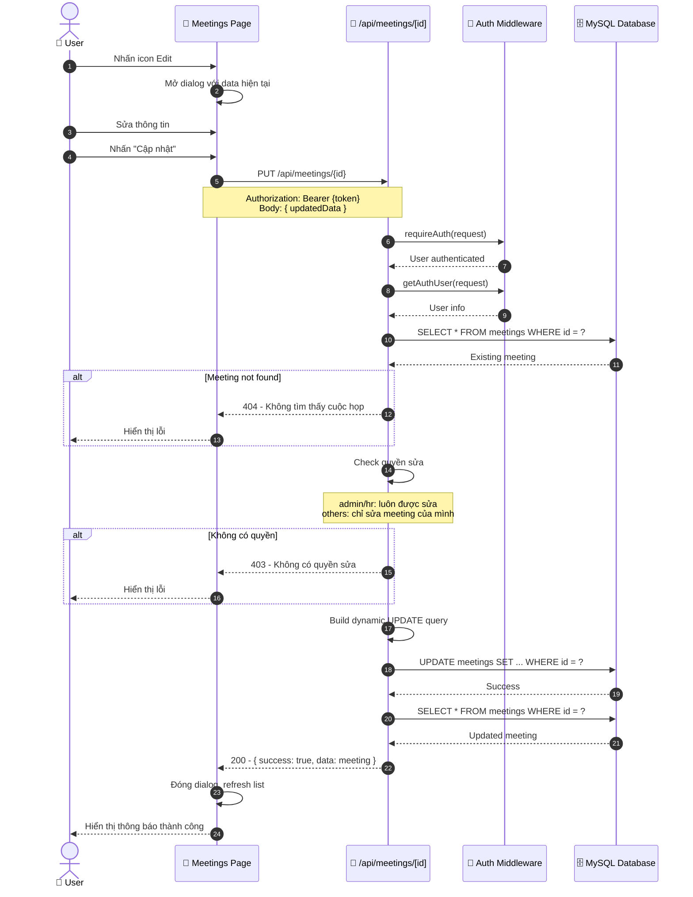
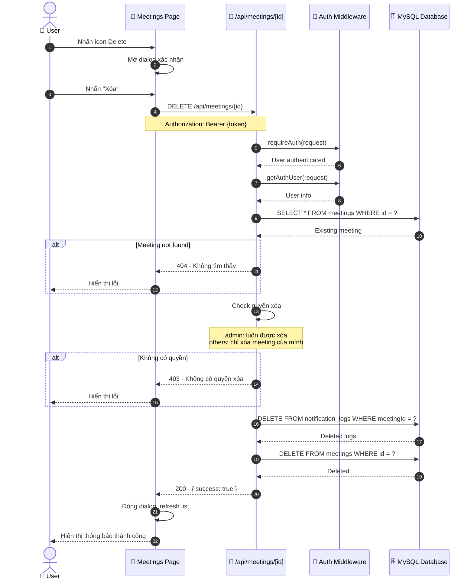
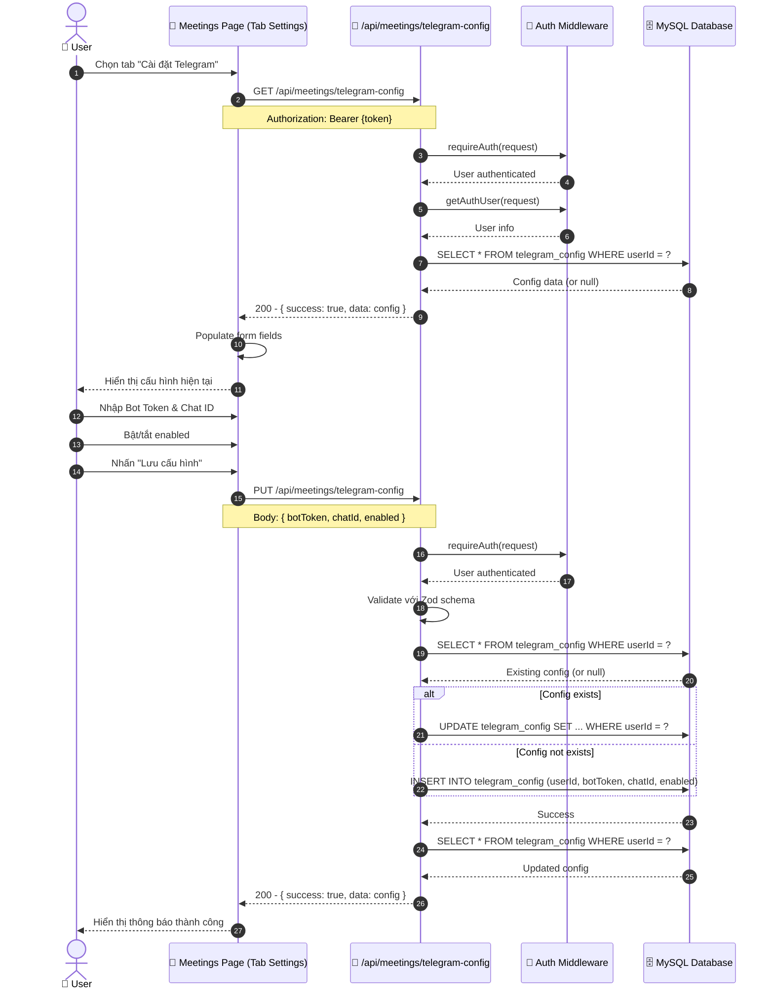
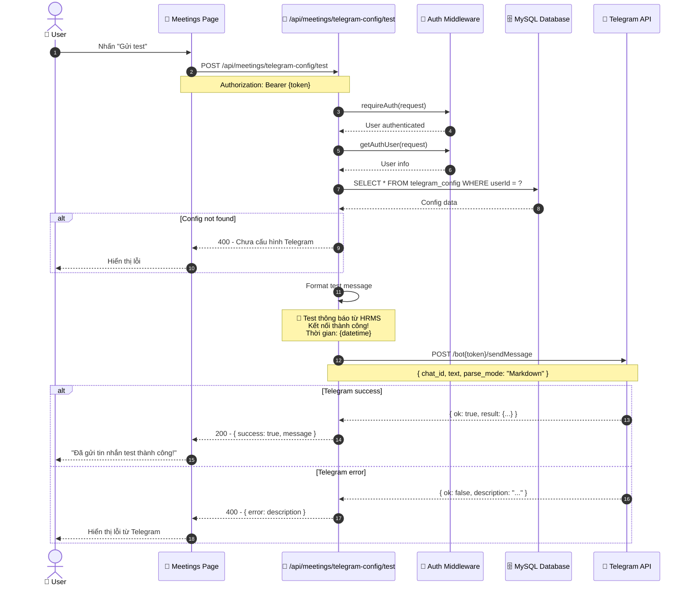
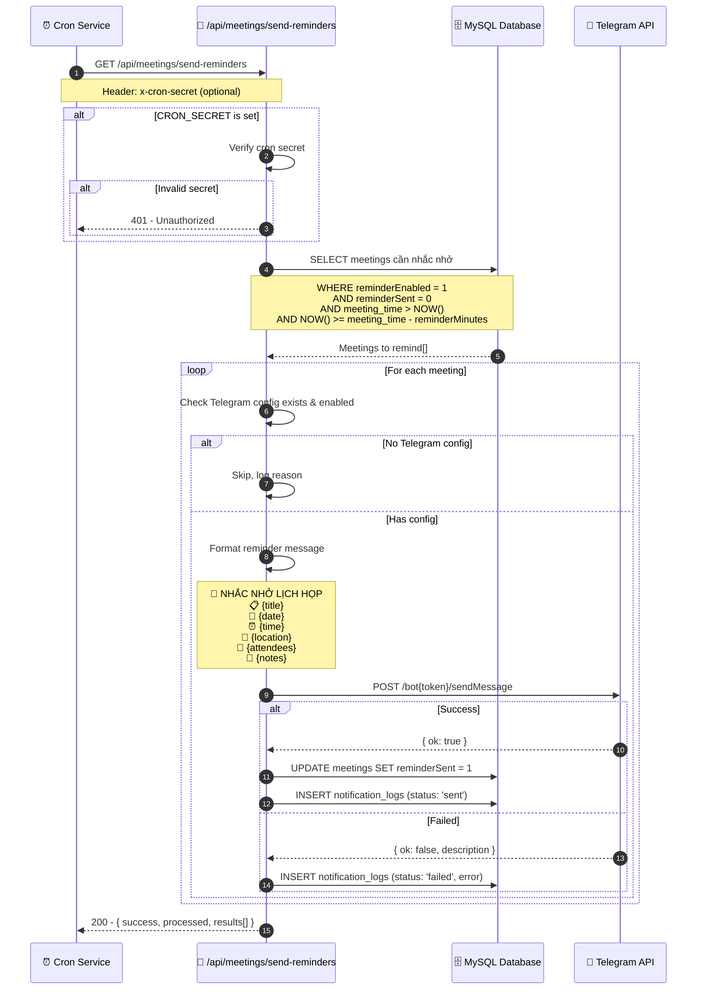
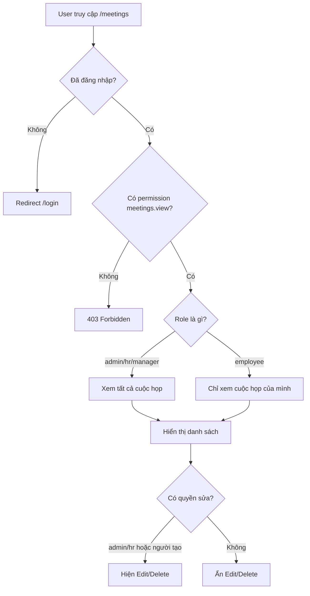

# Sequence Diagram: Quản lý Lịch họp (Meetings Management)

## 1. Tạo cuộc họp mới (Create Meeting)

## 2. Xem danh sách cuộc họp (List Meetings)

## 3. Cập nhật cuộc họp (Update Meeting)

## 4. Xóa cuộc họp (Delete Meeting)

## 5. Cấu hình Telegram Bot (Telegram Config)

## 6. Test kết nối Telegram (Test Telegram Connection)

## 7. Gửi nhắc nhở tự động (Send Reminders - Cron Job)

## 8. Luồng phân quyền xem cuộc họp

## Mô tả các bảng dữ liệu

### Bảng `meetings`
| Column | Type | Description |
|--------|------|-------------|
| id | INT | Primary Key, Auto Increment |
| title | VARCHAR(255) | Tiêu đề cuộc họp |
| date | DATE | Ngày họp |
| time | TIME | Giờ bắt đầu |
| duration | INT | Thời lượng (phút) |
| location | VARCHAR(255) | Địa điểm |
| attendees | TEXT | Danh sách người tham dự |
| notes | TEXT | Ghi chú, nội dung |
| reminderEnabled | BOOLEAN | Bật/tắt nhắc nhở |
| reminderMinutes | INT | Nhắc trước bao nhiêu phút |
| reminderSent | BOOLEAN | Đã gửi nhắc nhở chưa |
| createdBy | INT | FK → employees.id |
| createdAt | TIMESTAMP | Thời gian tạo |
| updatedAt | TIMESTAMP | Thời gian cập nhật |

### Bảng `telegram_config`
| Column | Type | Description |
|--------|------|-------------|
| id | INT | Primary Key, Auto Increment |
| userId | INT | FK → users.id (Unique) |
| botToken | VARCHAR(255) | Token của Telegram Bot |
| chatId | VARCHAR(100) | ID chat/group/channel |
| enabled | BOOLEAN | Bật/tắt thông báo |
| createdAt | TIMESTAMP | Thời gian tạo |
| updatedAt | TIMESTAMP | Thời gian cập nhật |

### Bảng `notification_logs`
| Column | Type | Description |
|--------|------|-------------|
| id | INT | Primary Key, Auto Increment |
| meetingId | INT | FK → meetings.id |
| status | ENUM | 'sent' / 'failed' |
| error | TEXT | Chi tiết lỗi (nếu failed) |
| sentAt | TIMESTAMP | Thời gian gửi |

## Permissions liên quan
- `meetings.view` - Xem danh sách cuộc họp
- `meetings.create` - Tạo cuộc họp mới
- `meetings.update` - Cập nhật cuộc họp
- `meetings.delete` - Xóa cuộc họp
- `meetings.config` - Cấu hình Telegram
