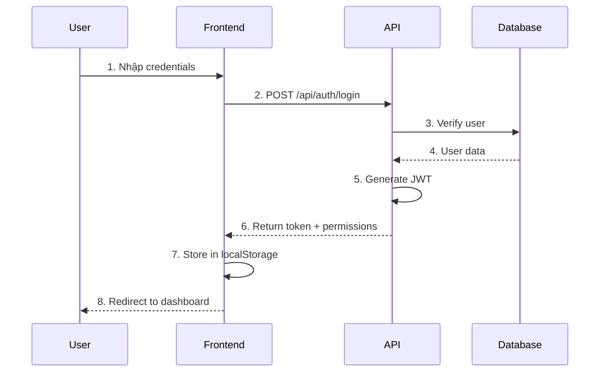

# Sequence Diagrams - HR Management System

Tài liệu này mô tả các Sequence Diagram chi tiết cho từng chức năng trong hệ thống Quản lý Nhân sự (HRMS).

## 📁 Danh sách các file Sequence Diagram

| File | Module | Mô tả |
|------|--------|-------|
| [01-authentication.md](./01-authentication.md) | Authentication | Đăng nhập, đăng xuất, xác thực JWT |
| [02-departments.md](./02-departments.md) | Departments | Quản lý phòng ban (CRUD) |
| [03-employees.md](./03-employees.md) | Employees | Quản lý nhân viên, cấp tài khoản |
| [04-leaves.md](./04-leaves.md) | Leaves | Quản lý nghỉ phép, duyệt đơn |
| [05-overtime.md](./05-overtime.md) | Overtime | Quản lý làm ngoài giờ, duyệt đơn |
| [06-rbac-roles.md](./06-rbac-roles.md) | RBAC - Roles | Quản lý vai trò |
| [07-rbac-users.md](./07-rbac-users.md) | RBAC - Users | Quản lý người dùng |
| [08-rbac-permissions.md](./08-rbac-permissions.md) | RBAC - Permissions | Quản lý phân quyền |

## 🏗️ Kiến trúc tổng quan

```
┌─────────────────────────────────────────────────────────────────┐
│                         Frontend (Next.js)                       │
│  ┌─────────────┐  ┌─────────────┐  ┌─────────────┐              │
│  │  LoginPage  │  │ EmployeePage│  │  LeavePage  │  ...         │
│  └──────┬──────┘  └──────┬──────┘  └──────┬──────┘              │
│         │                │                │                      │
│  ┌──────▼────────────────▼────────────────▼──────┐              │
│  │              useAuth Hook                      │              │
│  │  (Authentication, Permissions, Token)          │              │
│  └──────────────────────┬───────────────────────┬┘              │
└─────────────────────────┼───────────────────────┼───────────────┘
                          │ HTTP Request          │
                          │ + JWT Token           │
┌─────────────────────────▼───────────────────────▼───────────────┐
│                      API Routes (Next.js)                        │
│  ┌─────────────────────────────────────────────────────────┐    │
│  │                   Auth Middleware                        │    │
│  │  - requireAuth() : Xác thực JWT token                   │    │
│  │  - requireRole() : Kiểm tra role                        │    │
│  │  - requirePermission() : Kiểm tra permission            │    │
│  └─────────────────────────────────────────────────────────┘    │
│                              │                                   │
│  ┌───────────┐  ┌───────────┐  ┌───────────┐  ┌───────────┐    │
│  │ /api/auth │  │/api/dept  │  │ /api/emp  │  │/api/leave │    │
│  └─────┬─────┘  └─────┬─────┘  └─────┬─────┘  └─────┬─────┘    │
└────────┼──────────────┼──────────────┼──────────────┼───────────┘
         │              │              │              │
         └──────────────┴──────────────┴──────────────┘
                               │
┌──────────────────────────────▼──────────────────────────────────┐
│                        MySQL Database                            │
│  ┌─────────┐ ┌───────────┐ ┌──────────┐ ┌────────┐ ┌─────────┐ │
│  │  users  │ │ employees │ │departments│ │ leaves │ │overtime │ │
│  └────┬────┘ └─────┬─────┘ └────┬─────┘ └───┬────┘ └────┬────┘ │
│       │            │            │           │           │       │
│  ┌────▼────┐ ┌─────▼─────┐                                     │
│  │  roles  │ │permissions│                                      │
│  └────┬────┘ └─────┬─────┘                                      │
│       │            │                                             │
│  ┌────▼────────────▼────┐                                       │
│  │   role_permissions   │                                       │
│  │     user_roles       │                                       │
│  └──────────────────────┘                                       │
└─────────────────────────────────────────────────────────────────┘
```

## 🔐 Luồng xác thực (Authentication Flow)



## 🛡️ Mô hình phân quyền (RBAC)

```
User ──────► User_Roles ──────► Roles
                                  │
                                  ▼
                          Role_Permissions
                                  │
                                  ▼
                            Permissions
```

### Các vai trò mặc định:
- **Admin**: Toàn quyền hệ thống
- **HR**: Quản lý nhân viên, phòng ban, nghỉ phép
- **Manager**: Duyệt đơn, xem báo cáo phòng ban
- **Employee**: Xem/tạo đơn của mình

## 📋 Danh sách chức năng theo module

### 1. Authentication
- [x] Đăng nhập (Login)
- [x] Đăng xuất (Logout)
- [x] Kiểm tra xác thực (Auth check)
- [x] Tạo user mới (Admin only)

### 2. Departments
- [x] Xem danh sách phòng ban
- [x] Thêm phòng ban
- [x] Sửa phòng ban
- [x] Xóa phòng ban
- [x] Gán quản lý phòng ban

### 3. Employees
- [x] Xem danh sách nhân viên
- [x] Thêm nhân viên
- [x] Sửa nhân viên
- [x] Xóa nhân viên
- [x] Cấp tài khoản cho nhân viên
- [x] Tìm kiếm & lọc

### 4. Leaves (Nghỉ phép)
- [x] Xem danh sách đơn nghỉ
- [x] Tạo đơn nghỉ phép
- [x] Sửa đơn (khi pending)
- [x] Xóa đơn
- [x] Duyệt đơn
- [x] Từ chối đơn
- [x] Nghỉ theo buổi (half-day)

### 5. Overtime (Ngoài giờ)
- [x] Xem danh sách đơn
- [x] Tạo đơn ngoài giờ
- [x] Sửa đơn (khi pending)
- [x] Xóa đơn
- [x] Duyệt đơn
- [x] Từ chối đơn

### 6. RBAC - Roles
- [x] Xem danh sách vai trò
- [x] Thêm vai trò
- [x] Sửa vai trò
- [x] Xóa vai trò
- [x] Phân quyền cho vai trò

### 7. RBAC - Users
- [x] Xem danh sách users
- [x] Thêm user
- [x] Sửa user
- [x] Xóa user
- [x] Gán vai trò
- [x] Reset mật khẩu

### 8. RBAC - Permissions
- [x] Xem danh sách permissions
- [x] Gán permissions cho role
- [x] Kiểm tra permission (client & server)

## 🔧 Công nghệ sử dụng

| Layer | Technology |
|-------|------------|
| Frontend | Next.js 14, React, MUI |
| API | Next.js API Routes |
| Database | MySQL |
| Authentication | JWT (jsonwebtoken) |
| Validation | Zod |
| Password | bcryptjs |

## 📝 Conventions

### API Response Format
```typescript
// Success
{
  success: true,
  data: { ... },
  message?: string
}

// Error
{
  success: false,
  error: string
}
```

### Permission Code Format
```
{module}.{action}

Ví dụ:
- employees.view
- employees.create
- leaves.approve
```

### Status Values
| Module | Status Values |
|--------|---------------|
| Employee | active, inactive |
| Leave | pending, approved, rejected |
| Overtime | pending, approved, rejected |
| Role | isActive: true/false |
